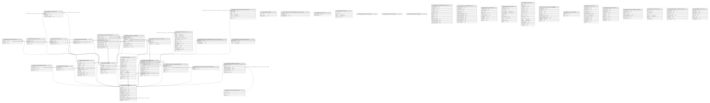

# golang-template

## Tables

| Name | Columns | Comment | Type |
| ---- | ------- | ------- | ---- |
| [_timescaledb_catalog.hypertable](_timescaledb_catalog.hypertable.md) | 12 |  | BASE TABLE |
| [_timescaledb_catalog.hypertable_data_node](_timescaledb_catalog.hypertable_data_node.md) | 4 |  | BASE TABLE |
| [_timescaledb_catalog.tablespace](_timescaledb_catalog.tablespace.md) | 3 |  | BASE TABLE |
| [_timescaledb_catalog.dimension](_timescaledb_catalog.dimension.md) | 12 |  | BASE TABLE |
| [_timescaledb_catalog.dimension_partition](_timescaledb_catalog.dimension_partition.md) | 3 |  | BASE TABLE |
| [_timescaledb_catalog.dimension_slice](_timescaledb_catalog.dimension_slice.md) | 4 |  | BASE TABLE |
| [_timescaledb_catalog.chunk](_timescaledb_catalog.chunk.md) | 8 |  | BASE TABLE |
| [_timescaledb_catalog.chunk_constraint](_timescaledb_catalog.chunk_constraint.md) | 4 |  | BASE TABLE |
| [_timescaledb_catalog.chunk_index](_timescaledb_catalog.chunk_index.md) | 4 |  | BASE TABLE |
| [_timescaledb_catalog.chunk_data_node](_timescaledb_catalog.chunk_data_node.md) | 3 |  | BASE TABLE |
| [_timescaledb_config.bgw_job](_timescaledb_config.bgw_job.md) | 17 |  | BASE TABLE |
| [_timescaledb_internal.bgw_job_stat](_timescaledb_internal.bgw_job_stat.md) | 15 |  | BASE TABLE |
| [_timescaledb_internal.bgw_policy_chunk_stats](_timescaledb_internal.bgw_policy_chunk_stats.md) | 4 |  | BASE TABLE |
| [_timescaledb_catalog.metadata](_timescaledb_catalog.metadata.md) | 3 |  | BASE TABLE |
| [_timescaledb_catalog.continuous_agg](_timescaledb_catalog.continuous_agg.md) | 12 |  | BASE TABLE |
| [_timescaledb_catalog.continuous_aggs_bucket_function](_timescaledb_catalog.continuous_aggs_bucket_function.md) | 6 |  | BASE TABLE |
| [_timescaledb_catalog.continuous_aggs_invalidation_threshold](_timescaledb_catalog.continuous_aggs_invalidation_threshold.md) | 2 |  | BASE TABLE |
| [_timescaledb_catalog.continuous_aggs_hypertable_invalidation_log](_timescaledb_catalog.continuous_aggs_hypertable_invalidation_log.md) | 3 |  | BASE TABLE |
| [_timescaledb_catalog.continuous_aggs_materialization_invalidation_log](_timescaledb_catalog.continuous_aggs_materialization_invalidation_log.md) | 3 |  | BASE TABLE |
| [_timescaledb_catalog.compression_algorithm](_timescaledb_catalog.compression_algorithm.md) | 4 |  | BASE TABLE |
| [_timescaledb_catalog.hypertable_compression](_timescaledb_catalog.hypertable_compression.md) | 7 |  | BASE TABLE |
| [_timescaledb_catalog.compression_chunk_size](_timescaledb_catalog.compression_chunk_size.md) | 10 |  | BASE TABLE |
| [_timescaledb_catalog.remote_txn](_timescaledb_catalog.remote_txn.md) | 2 |  | BASE TABLE |
| [_timescaledb_catalog.chunk_copy_operation](_timescaledb_catalog.chunk_copy_operation.md) | 9 |  | BASE TABLE |
| [_timescaledb_catalog.continuous_agg_migrate_plan](_timescaledb_catalog.continuous_agg_migrate_plan.md) | 3 |  | BASE TABLE |
| [_timescaledb_catalog.continuous_agg_migrate_plan_step](_timescaledb_catalog.continuous_agg_migrate_plan_step.md) | 7 |  | BASE TABLE |
| [_timescaledb_internal.job_errors](_timescaledb_internal.job_errors.md) | 5 |  | BASE TABLE |
| [_timescaledb_cache.cache_inval_hypertable](_timescaledb_cache.cache_inval_hypertable.md) | 0 |  | BASE TABLE |
| [_timescaledb_cache.cache_inval_bgw_job](_timescaledb_cache.cache_inval_bgw_job.md) | 0 |  | BASE TABLE |
| [_timescaledb_cache.cache_inval_extension](_timescaledb_cache.cache_inval_extension.md) | 0 |  | BASE TABLE |
| [_timescaledb_internal.hypertable_chunk_local_size](_timescaledb_internal.hypertable_chunk_local_size.md) | 14 |  | VIEW |
| [_timescaledb_internal.compressed_chunk_stats](_timescaledb_internal.compressed_chunk_stats.md) | 13 |  | VIEW |
| [timescaledb_information.hypertables](timescaledb_information.hypertables.md) | 10 |  | VIEW |
| [timescaledb_information.job_stats](timescaledb_information.job_stats.md) | 12 |  | VIEW |
| [timescaledb_information.jobs](timescaledb_information.jobs.md) | 18 |  | VIEW |
| [timescaledb_information.continuous_aggregates](timescaledb_information.continuous_aggregates.md) | 11 |  | VIEW |
| [timescaledb_information.data_nodes](timescaledb_information.data_nodes.md) | 3 |  | VIEW |
| [timescaledb_information.chunks](timescaledb_information.chunks.md) | 13 |  | VIEW |
| [timescaledb_information.dimensions](timescaledb_information.dimensions.md) | 10 |  | VIEW |
| [timescaledb_information.compression_settings](timescaledb_information.compression_settings.md) | 7 |  | VIEW |
| [timescaledb_information.job_errors](timescaledb_information.job_errors.md) | 8 |  | VIEW |
| [timescaledb_experimental.chunk_replication_status](timescaledb_experimental.chunk_replication_status.md) | 8 |  | VIEW |
| [timescaledb_experimental.policies](timescaledb_experimental.policies.md) | 8 |  | VIEW |

## Stored procedures and functions

| Name | ReturnType | Arguments | Type |
| ---- | ------- | ------- | ---- |
| _timescaledb_internal.compressed_data_in | compressed_data | cstring | FUNCTION |
| _timescaledb_internal.compressed_data_out | cstring | _timescaledb_internal.compressed_data | FUNCTION |
| _timescaledb_internal.compressed_data_send | bytea | _timescaledb_internal.compressed_data | FUNCTION |
| _timescaledb_internal.compressed_data_recv | compressed_data | internal | FUNCTION |
| _timescaledb_internal.rxid_in | rxid | cstring | FUNCTION |
| _timescaledb_internal.rxid_out | cstring | rxid | FUNCTION |
| public.timescaledb_fdw_handler | fdw_handler |  | FUNCTION |
| public.timescaledb_fdw_validator | void | text[], oid | FUNCTION |
| _timescaledb_internal.insert_blocker | trigger |  | FUNCTION |
| _timescaledb_internal.continuous_agg_invalidation_trigger | trigger |  | FUNCTION |
| _timescaledb_internal.to_date | date | unixtime_us bigint | FUNCTION |
| _timescaledb_internal.to_interval | interval | unixtime_us bigint | FUNCTION |
| public.set_integer_now_func | void | hypertable regclass, integer_now_func regproc, replace_if_exists boolean DEFAULT false | FUNCTION |
| _timescaledb_internal.calculate_chunk_interval | int8 | dimension_id integer, dimension_coord bigint, chunk_target_size bigint | FUNCTION |
| _timescaledb_internal.chunk_status | int4 | regclass | FUNCTION |
| _timescaledb_internal.chunks_in | bool | record record, chunks integer[] | FUNCTION |
| _timescaledb_internal.chunk_id_from_relid | int4 | relid oid | FUNCTION |
| public.time_bucket | timestamptz | bucket_width interval, ts timestamp with time zone, "offset" interval | FUNCTION |
| public.time_bucket | date | bucket_width interval, ts date, "offset" interval | FUNCTION |
| _timescaledb_internal.show_chunk | record | chunk regclass | FUNCTION |
| timescaledb_experimental.time_bucket_ng | timestamp | bucket_width interval, ts timestamp without time zone, origin timestamp without time zone | FUNCTION |
| _timescaledb_internal.create_chunk | record | hypertable regclass, slices jsonb, schema_name name DEFAULT NULL::name, table_name name DEFAULT NULL::name, chunk_table regclass DEFAULT NULL::regclass | FUNCTION |
| _timescaledb_internal.set_chunk_default_data_node | bool | chunk regclass, node_name name | FUNCTION |
| _timescaledb_internal.get_chunk_relstats | record | relid regclass | FUNCTION |
| _timescaledb_internal.get_chunk_colstats | record | relid regclass | FUNCTION |
| _timescaledb_internal.create_chunk_table | bool | hypertable regclass, slices jsonb, schema_name name, table_name name | FUNCTION |
| _timescaledb_internal.freeze_chunk | bool | chunk regclass | FUNCTION |
| _timescaledb_internal.unfreeze_chunk | bool | chunk regclass | FUNCTION |
| _timescaledb_internal.drop_chunk | bool | chunk regclass | FUNCTION |
| _timescaledb_internal.attach_osm_table_chunk | bool | hypertable regclass, chunk regclass | FUNCTION |
| timescaledb_experimental.time_bucket_ng | timestamptz | bucket_width interval, ts timestamp with time zone, timezone text | FUNCTION |
| _timescaledb_internal.ping_data_node | bool | node_name name, timeout interval DEFAULT NULL::interval | FUNCTION |
| _timescaledb_internal.remote_txn_heal_data_node | int4 | foreign_server_oid oid | FUNCTION |
| _timescaledb_internal.chunk_index_clone | oid | chunk_index_oid oid | FUNCTION |
| _timescaledb_internal.chunk_index_replace | void | chunk_index_oid_old oid, chunk_index_oid_new oid | FUNCTION |
| _timescaledb_internal.create_chunk_replica_table | void | chunk regclass, data_node_name name | FUNCTION |
| _timescaledb_internal.chunk_drop_replica | void | chunk regclass, node_name name | FUNCTION |
| timescaledb_experimental.time_bucket_ng | timestamptz | bucket_width interval, ts timestamp with time zone, origin timestamp with time zone, timezone text | FUNCTION |
| timescaledb_experimental.time_bucket_ng | timestamptz | bucket_width interval, ts timestamp with time zone | FUNCTION |
| timescaledb_experimental.time_bucket_ng | timestamptz | bucket_width interval, ts timestamp with time zone, origin timestamp with time zone | FUNCTION |
| public.time_bucket | timestamptz | bucket_width interval, ts timestamp with time zone, timezone text, origin timestamp with time zone DEFAULT NULL::timestamp with time zone, "offset" interval DEFAULT NULL::interval | FUNCTION |
| public.time_bucket | int2 | bucket_width smallint, ts smallint | FUNCTION |
| public.time_bucket | int4 | bucket_width integer, ts integer | FUNCTION |
| public.time_bucket | int8 | bucket_width bigint, ts bigint | FUNCTION |
| public.time_bucket | int2 | bucket_width smallint, ts smallint, "offset" smallint | FUNCTION |
| _timescaledb_internal.wait_subscription_sync | void | IN schema_name name, IN table_name name, IN retry_count integer DEFAULT 18000, IN retry_delay_ms numeric DEFAULT 0.200 | PROCEDURE |
| _timescaledb_internal.health | record |  | FUNCTION |
| _timescaledb_internal.drop_stale_chunks | void | node_name name, chunks integer[] DEFAULT NULL::integer[] | FUNCTION |
| timescaledb_experimental.block_new_chunks | int4 | data_node_name name, hypertable regclass DEFAULT NULL::regclass, force boolean DEFAULT false | FUNCTION |
| timescaledb_experimental.allow_new_chunks | int4 | data_node_name name, hypertable regclass DEFAULT NULL::regclass | FUNCTION |
| timescaledb_experimental.move_chunk | void | IN chunk regclass, IN source_node name DEFAULT NULL::name, IN destination_node name DEFAULT NULL::name, IN operation_id name DEFAULT NULL::name | PROCEDURE |
| timescaledb_experimental.copy_chunk | void | IN chunk regclass, IN source_node name DEFAULT NULL::name, IN destination_node name DEFAULT NULL::name, IN operation_id name DEFAULT NULL::name | PROCEDURE |
| timescaledb_experimental.subscription_exec | void | subscription_command text | FUNCTION |
| timescaledb_experimental.cleanup_copy_chunk_operation | void | IN operation_id name | PROCEDURE |
| _timescaledb_internal.to_unix_microseconds | int8 | ts timestamp with time zone | FUNCTION |
| _timescaledb_internal.to_timestamp | timestamptz | unixtime_us bigint | FUNCTION |
| _timescaledb_internal.to_timestamp_without_timezone | timestamp | unixtime_us bigint | FUNCTION |
| _timescaledb_internal.time_literal_sql | text | time_value bigint, column_type regtype | FUNCTION |
| _timescaledb_internal.interval_to_usec | int8 | chunk_interval interval | FUNCTION |
| _timescaledb_internal.time_to_internal | int8 | time_val anyelement | FUNCTION |
| _timescaledb_internal.cagg_watermark | int8 | hypertable_id integer | FUNCTION |
| _timescaledb_internal.subtract_integer_from_now | int8 | hypertable_relid regclass, lag bigint | FUNCTION |
| _timescaledb_internal.dimension_is_finite | bool | val bigint | FUNCTION |
| _timescaledb_internal.dimension_slice_get_constraint_sql | text | dimension_slice_id integer | FUNCTION |
| _timescaledb_internal.get_create_command | text | table_name name | FUNCTION |
| _timescaledb_internal.chunk_constraint_add_table_constraint | void | chunk_constraint_row _timescaledb_catalog.chunk_constraint | FUNCTION |
| public.time_bucket | int4 | bucket_width integer, ts integer, "offset" integer | FUNCTION |
| public.time_bucket | int8 | bucket_width bigint, ts bigint, "offset" bigint | FUNCTION |
| _timescaledb_internal.hypertable_constraint_add_table_fk_constraint | void | user_ht_constraint_name name, user_ht_schema_name name, user_ht_table_name name, compress_ht_id integer | FUNCTION |
| _timescaledb_internal.get_partition_for_key | int4 | val anyelement | FUNCTION |
| _timescaledb_internal.get_partition_hash | int4 | val anyelement | FUNCTION |
| _timescaledb_internal.get_time_type | oid | hypertable_id integer | FUNCTION |
| _timescaledb_internal.is_main_table | bool | table_oid regclass | FUNCTION |
| _timescaledb_internal.is_main_table | bool | schema_name name, table_name name | FUNCTION |
| _timescaledb_internal.hypertable_from_main_table | hypertable | table_oid regclass | FUNCTION |
| _timescaledb_internal.main_table_from_hypertable | regclass | hypertable_id integer | FUNCTION |
| public.create_hypertable | record | relation regclass, time_column_name name, partitioning_column name DEFAULT NULL::name, number_partitions integer DEFAULT NULL::integer, associated_schema_name name DEFAULT NULL::name, associated_table_prefix name DEFAULT NULL::name, chunk_time_interval anyelement DEFAULT NULL::bigint, create_default_indexes boolean DEFAULT true, if_not_exists boolean DEFAULT false, partitioning_func regproc DEFAULT NULL::regproc, migrate_data boolean DEFAULT false, chunk_target_size text DEFAULT NULL::text, chunk_sizing_func regproc DEFAULT '_timescaledb_internal.calculate_chunk_interval'::regproc, time_partitioning_func regproc DEFAULT NULL::regproc, replication_factor integer DEFAULT NULL::integer, data_nodes name[] DEFAULT NULL::name[], distributed boolean DEFAULT NULL::boolean | FUNCTION |
| public.create_distributed_hypertable | record | relation regclass, time_column_name name, partitioning_column name DEFAULT NULL::name, number_partitions integer DEFAULT NULL::integer, associated_schema_name name DEFAULT NULL::name, associated_table_prefix name DEFAULT NULL::name, chunk_time_interval anyelement DEFAULT NULL::bigint, create_default_indexes boolean DEFAULT true, if_not_exists boolean DEFAULT false, partitioning_func regproc DEFAULT NULL::regproc, migrate_data boolean DEFAULT false, chunk_target_size text DEFAULT NULL::text, chunk_sizing_func regproc DEFAULT '_timescaledb_internal.calculate_chunk_interval'::regproc, time_partitioning_func regproc DEFAULT NULL::regproc, replication_factor integer DEFAULT NULL::integer, data_nodes name[] DEFAULT NULL::name[] | FUNCTION |
| public.set_adaptive_chunking | record | hypertable regclass, chunk_target_size text, INOUT chunk_sizing_func regproc DEFAULT '_timescaledb_internal.calculate_chunk_interval'::regproc, OUT chunk_target_size bigint | FUNCTION |
| public.set_chunk_time_interval | void | hypertable regclass, chunk_time_interval anyelement, dimension_name name DEFAULT NULL::name | FUNCTION |
| public.set_number_partitions | void | hypertable regclass, number_partitions integer, dimension_name name DEFAULT NULL::name | FUNCTION |
| public.drop_chunks | text | relation regclass, older_than "any" DEFAULT NULL::unknown, newer_than "any" DEFAULT NULL::unknown, "verbose" boolean DEFAULT false | FUNCTION |
| public.show_chunks | regclass | relation regclass, older_than "any" DEFAULT NULL::unknown, newer_than "any" DEFAULT NULL::unknown | FUNCTION |
| public.add_dimension | record | hypertable regclass, column_name name, number_partitions integer DEFAULT NULL::integer, chunk_time_interval anyelement DEFAULT NULL::bigint, partitioning_func regproc DEFAULT NULL::regproc, if_not_exists boolean DEFAULT false | FUNCTION |
| public.attach_tablespace | void | tablespace name, hypertable regclass, if_not_attached boolean DEFAULT false | FUNCTION |
| public.detach_tablespace | int4 | tablespace name, hypertable regclass DEFAULT NULL::regclass, if_attached boolean DEFAULT false | FUNCTION |
| public.detach_tablespaces | int4 | hypertable regclass | FUNCTION |
| public.show_tablespaces | name | hypertable regclass | FUNCTION |
| public.add_data_node | record | node_name name, host text, database name DEFAULT NULL::name, port integer DEFAULT NULL::integer, if_not_exists boolean DEFAULT false, bootstrap boolean DEFAULT true, password text DEFAULT NULL::text | FUNCTION |
| public.delete_data_node | bool | node_name name, if_exists boolean DEFAULT false, force boolean DEFAULT false, repartition boolean DEFAULT true, drop_database boolean DEFAULT false | FUNCTION |
| public.attach_data_node | record | node_name name, hypertable regclass, if_not_attached boolean DEFAULT false, repartition boolean DEFAULT true | FUNCTION |
| timescaledb_experimental.time_bucket_ng | date | bucket_width interval, ts date | FUNCTION |
| timescaledb_experimental.time_bucket_ng | date | bucket_width interval, ts date, origin date | FUNCTION |
| timescaledb_experimental.time_bucket_ng | timestamp | bucket_width interval, ts timestamp without time zone | FUNCTION |
| public.detach_data_node | int4 | node_name name, hypertable regclass DEFAULT NULL::regclass, if_attached boolean DEFAULT false, force boolean DEFAULT false, repartition boolean DEFAULT true, drop_remote_data boolean DEFAULT false | FUNCTION |
| public.distributed_exec | void | IN query text, IN node_list name[] DEFAULT NULL::name[], IN transactional boolean DEFAULT true | PROCEDURE |
| public.create_distributed_restore_point | record | name text | FUNCTION |
| public.set_replication_factor | void | hypertable regclass, replication_factor integer | FUNCTION |
| public.refresh_continuous_aggregate | void | IN continuous_aggregate regclass, IN window_start "any", IN window_end "any" | PROCEDURE |
| public.alter_data_node | record | node_name name, host text DEFAULT NULL::text, database name DEFAULT NULL::name, port integer DEFAULT NULL::integer, available boolean DEFAULT NULL::boolean | FUNCTION |
| _timescaledb_internal.process_ddl_event | event_trigger |  | FUNCTION |
| _timescaledb_internal.first_sfunc | internal | internal, anyelement, "any" | FUNCTION |
| _timescaledb_internal.first_combinefunc | internal | internal, internal | FUNCTION |
| _timescaledb_internal.last_sfunc | internal | internal, anyelement, "any" | FUNCTION |
| _timescaledb_internal.last_combinefunc | internal | internal, internal | FUNCTION |
| _timescaledb_internal.bookend_finalfunc | anyelement | internal, anyelement, "any" | FUNCTION |
| _timescaledb_internal.bookend_serializefunc | bytea | internal | FUNCTION |
| _timescaledb_internal.bookend_deserializefunc | internal | bytea, internal | FUNCTION |
| public.first | anyelement | anyelement, "any" | a |
| public.last | anyelement | anyelement, "any" | a |
| public.time_bucket | timestamp | bucket_width interval, ts timestamp without time zone | FUNCTION |
| public.time_bucket | timestamptz | bucket_width interval, ts timestamp with time zone | FUNCTION |
| public.time_bucket | date | bucket_width interval, ts date | FUNCTION |
| public.time_bucket | timestamp | bucket_width interval, ts timestamp without time zone, origin timestamp without time zone | FUNCTION |
| public.time_bucket | timestamptz | bucket_width interval, ts timestamp with time zone, origin timestamp with time zone | FUNCTION |
| public.time_bucket | date | bucket_width interval, ts date, origin date | FUNCTION |
| public.time_bucket | timestamp | bucket_width interval, ts timestamp without time zone, "offset" interval | FUNCTION |
| _timescaledb_internal.get_git_commit | record |  | FUNCTION |
| _timescaledb_internal.get_os_info | record |  | FUNCTION |
| _timescaledb_internal.tsl_loaded | bool |  | FUNCTION |
| _timescaledb_internal.relation_size | record | relation regclass | FUNCTION |
| _timescaledb_internal.data_node_hypertable_info | record | node_name name, schema_name_in name, table_name_in name | FUNCTION |
| _timescaledb_internal.data_node_chunk_info | record | node_name name, schema_name_in name, table_name_in name | FUNCTION |
| _timescaledb_internal.hypertable_local_size | record | schema_name_in name, table_name_in name | FUNCTION |
| _timescaledb_internal.hypertable_remote_size | record | schema_name_in name, table_name_in name | FUNCTION |
| public.hypertable_detailed_size | record | hypertable regclass | FUNCTION |
| public.hypertable_size | int8 | hypertable regclass | FUNCTION |
| public.time_bucket_gapfill | timestamptz | bucket_width interval, ts timestamp with time zone, start timestamp with time zone DEFAULT NULL::timestamp with time zone, finish timestamp with time zone DEFAULT NULL::timestamp with time zone | FUNCTION |
| _timescaledb_internal.invalidation_process_hypertable_log | void | mat_hypertable_id integer, raw_hypertable_id integer, dimtype regtype, mat_hypertable_ids integer[], bucket_widths bigint[], max_bucket_widths bigint[] | FUNCTION |
| _timescaledb_internal.chunks_local_size | record | schema_name_in name, table_name_in name | FUNCTION |
| _timescaledb_internal.chunks_remote_size | record | schema_name_in name, table_name_in name | FUNCTION |
| public.chunks_detailed_size | record | hypertable regclass | FUNCTION |
| _timescaledb_internal.range_value_to_pretty | text | time_value bigint, column_type regtype | FUNCTION |
| public.approximate_row_count | int8 | relation regclass | FUNCTION |
| _timescaledb_internal.data_node_compressed_chunk_stats | record | node_name name, schema_name_in name, table_name_in name | FUNCTION |
| _timescaledb_internal.compressed_chunk_local_stats | record | schema_name_in name, table_name_in name | FUNCTION |
| _timescaledb_internal.compressed_chunk_remote_stats | record | schema_name_in name, table_name_in name | FUNCTION |
| public.chunk_compression_stats | record | hypertable regclass | FUNCTION |
| public.hypertable_compression_stats | record | hypertable regclass | FUNCTION |
| _timescaledb_internal.indexes_local_size | record | schema_name_in name, index_name_in name | FUNCTION |
| _timescaledb_internal.data_node_index_size | record | node_name name, schema_name_in name, index_name_in name | FUNCTION |
| _timescaledb_internal.indexes_remote_size | int8 | schema_name_in name, table_name_in name, index_name_in name | FUNCTION |
| _timescaledb_internal.invalidation_process_hypertable_log | void | mat_hypertable_id integer, raw_hypertable_id integer, dimtype regtype, mat_hypertable_ids integer[], bucket_widths bigint[], max_bucket_widths bigint[], bucket_functions text[] | FUNCTION |
| public.hypertable_index_size | int8 | index_name regclass | FUNCTION |
| _timescaledb_internal.hist_sfunc | internal | state internal, val double precision, min double precision, max double precision, nbuckets integer | FUNCTION |
| _timescaledb_internal.hist_combinefunc | internal | state1 internal, state2 internal | FUNCTION |
| _timescaledb_internal.hist_serializefunc | bytea | internal | FUNCTION |
| _timescaledb_internal.hist_deserializefunc | internal | bytea, internal | FUNCTION |
| _timescaledb_internal.hist_finalfunc | _int4 | state internal, val double precision, min double precision, max double precision, nbuckets integer | FUNCTION |
| public.histogram | _int4 | double precision, double precision, double precision, integer | a |
| _timescaledb_internal.restart_background_workers | bool |  | FUNCTION |
| _timescaledb_internal.stop_background_workers | bool |  | FUNCTION |
| _timescaledb_internal.start_background_workers | bool |  | FUNCTION |
| _timescaledb_internal.generate_uuid | uuid |  | FUNCTION |
| _timescaledb_internal.set_dist_id | bool | dist_id uuid | FUNCTION |
| _timescaledb_internal.set_peer_dist_id | bool | dist_id uuid | FUNCTION |
| _timescaledb_internal.validate_as_data_node | void |  | FUNCTION |
| _timescaledb_internal.show_connection_cache | record |  | FUNCTION |
| public.time_bucket_gapfill | int2 | bucket_width smallint, ts smallint, start smallint DEFAULT NULL::smallint, finish smallint DEFAULT NULL::smallint | FUNCTION |
| public.time_bucket_gapfill | int4 | bucket_width integer, ts integer, start integer DEFAULT NULL::integer, finish integer DEFAULT NULL::integer | FUNCTION |
| public.time_bucket_gapfill | int8 | bucket_width bigint, ts bigint, start bigint DEFAULT NULL::bigint, finish bigint DEFAULT NULL::bigint | FUNCTION |
| public.time_bucket_gapfill | date | bucket_width interval, ts date, start date DEFAULT NULL::date, finish date DEFAULT NULL::date | FUNCTION |
| public.time_bucket_gapfill | timestamp | bucket_width interval, ts timestamp without time zone, start timestamp without time zone DEFAULT NULL::timestamp without time zone, finish timestamp without time zone DEFAULT NULL::timestamp without time zone | FUNCTION |
| public.time_bucket_gapfill | timestamptz | bucket_width interval, ts timestamp with time zone, timezone text, start timestamp with time zone DEFAULT NULL::timestamp with time zone, finish timestamp with time zone DEFAULT NULL::timestamp with time zone | FUNCTION |
| public.locf | anyelement | value anyelement, prev anyelement DEFAULT NULL::unknown, treat_null_as_missing boolean DEFAULT false | FUNCTION |
| public.interpolate | int2 | value smallint, prev record DEFAULT NULL::record, next record DEFAULT NULL::record | FUNCTION |
| public.interpolate | int4 | value integer, prev record DEFAULT NULL::record, next record DEFAULT NULL::record | FUNCTION |
| public.interpolate | int8 | value bigint, prev record DEFAULT NULL::record, next record DEFAULT NULL::record | FUNCTION |
| public.interpolate | float4 | value real, prev record DEFAULT NULL::record, next record DEFAULT NULL::record | FUNCTION |
| public.interpolate | float8 | value double precision, prev record DEFAULT NULL::record, next record DEFAULT NULL::record | FUNCTION |
| public.reorder_chunk | void | chunk regclass, index regclass DEFAULT NULL::regclass, "verbose" boolean DEFAULT false | FUNCTION |
| public.move_chunk | void | chunk regclass, destination_tablespace name, index_destination_tablespace name DEFAULT NULL::name, reorder_index regclass DEFAULT NULL::regclass, "verbose" boolean DEFAULT false | FUNCTION |
| _timescaledb_internal.create_compressed_chunk | regclass | chunk regclass, chunk_table regclass, uncompressed_heap_size bigint, uncompressed_toast_size bigint, uncompressed_index_size bigint, compressed_heap_size bigint, compressed_toast_size bigint, compressed_index_size bigint, numrows_pre_compression bigint, numrows_post_compression bigint | FUNCTION |
| public.compress_chunk | regclass | uncompressed_chunk regclass, if_not_compressed boolean DEFAULT false | FUNCTION |
| public.decompress_chunk | regclass | uncompressed_chunk regclass, if_compressed boolean DEFAULT false | FUNCTION |
| timescaledb_experimental.add_policies | bool | relation regclass, if_not_exists boolean DEFAULT false, refresh_start_offset "any" DEFAULT NULL::unknown, refresh_end_offset "any" DEFAULT NULL::unknown, compress_after "any" DEFAULT NULL::unknown, drop_after "any" DEFAULT NULL::unknown | FUNCTION |
| public.recompress_chunk | void | IN chunk regclass, IN if_not_compressed boolean DEFAULT false | PROCEDURE |
| _timescaledb_internal.partialize_agg | bytea | arg anyelement | FUNCTION |
| _timescaledb_internal.finalize_agg_sfunc | internal | tstate internal, aggfn text, inner_agg_collation_schema name, inner_agg_collation_name name, inner_agg_input_types name[], inner_agg_serialized_state bytea, return_type_dummy_val anyelement | FUNCTION |
| _timescaledb_internal.finalize_agg_ffunc | anyelement | tstate internal, aggfn text, inner_agg_collation_schema name, inner_agg_collation_name name, inner_agg_input_types name[], inner_agg_serialized_state bytea, return_type_dummy_val anyelement | FUNCTION |
| _timescaledb_internal.finalize_agg | anyelement | agg_name text, inner_agg_collation_schema name, inner_agg_collation_name name, inner_agg_input_types name[], inner_agg_serialized_state bytea, return_type_dummy_val anyelement | a |
| public.timescaledb_pre_restore | bool |  | FUNCTION |
| public.timescaledb_post_restore | bool |  | FUNCTION |
| public.add_job | int4 | proc regproc, schedule_interval interval, config jsonb DEFAULT NULL::jsonb, initial_start timestamp with time zone DEFAULT NULL::timestamp with time zone, scheduled boolean DEFAULT true, check_config regproc DEFAULT NULL::regproc, fixed_schedule boolean DEFAULT true, timezone text DEFAULT NULL::text | FUNCTION |
| public.delete_job | void | job_id integer | FUNCTION |
| public.run_job | void | IN job_id integer | PROCEDURE |
| timescaledb_experimental.remove_policies | bool | relation regclass, if_exists boolean DEFAULT false, VARIADIC policy_names text[] DEFAULT NULL::text[] | FUNCTION |
| timescaledb_experimental.remove_all_policies | bool | relation regclass, if_exists boolean DEFAULT false | FUNCTION |
| public.alter_job | record | job_id integer, schedule_interval interval DEFAULT NULL::interval, max_runtime interval DEFAULT NULL::interval, max_retries integer DEFAULT NULL::integer, retry_period interval DEFAULT NULL::interval, scheduled boolean DEFAULT NULL::boolean, config jsonb DEFAULT NULL::jsonb, next_start timestamp with time zone DEFAULT NULL::timestamp with time zone, if_exists boolean DEFAULT false, check_config regproc DEFAULT NULL::regproc | FUNCTION |
| _timescaledb_internal.alter_job_set_hypertable_id | int4 | job_id integer, hypertable regclass | FUNCTION |
| public.add_retention_policy | int4 | relation regclass, drop_after "any", if_not_exists boolean DEFAULT false, schedule_interval interval DEFAULT NULL::interval, initial_start timestamp with time zone DEFAULT NULL::timestamp with time zone, timezone text DEFAULT NULL::text | FUNCTION |
| public.remove_retention_policy | void | relation regclass, if_exists boolean DEFAULT false | FUNCTION |
| public.add_reorder_policy | int4 | hypertable regclass, index_name name, if_not_exists boolean DEFAULT false, initial_start timestamp with time zone DEFAULT NULL::timestamp with time zone, timezone text DEFAULT NULL::text | FUNCTION |
| public.remove_reorder_policy | void | hypertable regclass, if_exists boolean DEFAULT false | FUNCTION |
| public.add_compression_policy | int4 | hypertable regclass, compress_after "any", if_not_exists boolean DEFAULT false, schedule_interval interval DEFAULT NULL::interval, initial_start timestamp with time zone DEFAULT NULL::timestamp with time zone, timezone text DEFAULT NULL::text | FUNCTION |
| public.remove_compression_policy | bool | hypertable regclass, if_exists boolean DEFAULT false | FUNCTION |
| public.add_continuous_aggregate_policy | int4 | continuous_aggregate regclass, start_offset "any", end_offset "any", schedule_interval interval, if_not_exists boolean DEFAULT false, initial_start timestamp with time zone DEFAULT NULL::timestamp with time zone, timezone text DEFAULT NULL::text | FUNCTION |
| public.remove_continuous_aggregate_policy | void | continuous_aggregate regclass, if_not_exists boolean DEFAULT false, if_exists boolean DEFAULT NULL::boolean | FUNCTION |
| _timescaledb_internal.drop_dist_ht_invalidation_trigger | void | raw_hypertable_id integer | FUNCTION |
| timescaledb_experimental.alter_policies | bool | relation regclass, if_exists boolean DEFAULT false, refresh_start_offset "any" DEFAULT NULL::unknown, refresh_end_offset "any" DEFAULT NULL::unknown, compress_after "any" DEFAULT NULL::unknown, drop_after "any" DEFAULT NULL::unknown | FUNCTION |
| timescaledb_experimental.show_policies | jsonb | relation regclass | FUNCTION |
| _timescaledb_internal.policy_retention | void | IN job_id integer, IN config jsonb | PROCEDURE |
| _timescaledb_internal.policy_retention_check | void | config jsonb | FUNCTION |
| _timescaledb_internal.policy_reorder | void | IN job_id integer, IN config jsonb | PROCEDURE |
| _timescaledb_internal.policy_reorder_check | void | config jsonb | FUNCTION |
| _timescaledb_internal.policy_recompression | void | IN job_id integer, IN config jsonb | PROCEDURE |
| _timescaledb_internal.policy_compression_check | void | config jsonb | FUNCTION |
| _timescaledb_internal.policy_refresh_continuous_aggregate | void | IN job_id integer, IN config jsonb | PROCEDURE |
| _timescaledb_internal.policy_refresh_continuous_aggregate_check | void | config jsonb | FUNCTION |
| _timescaledb_internal.policy_compression_execute | void | IN job_id integer, IN htid integer, IN lag anyelement, IN maxchunks integer, IN verbose_log boolean, IN recompress_enabled boolean | PROCEDURE |
| _timescaledb_internal.policy_compression | void | IN job_id integer, IN config jsonb | PROCEDURE |
| _timescaledb_internal.invalidation_cagg_log_add_entry | void | mat_hypertable_id integer, start_time bigint, end_time bigint | FUNCTION |
| _timescaledb_internal.invalidation_hyper_log_add_entry | void | raw_hypertable_id integer, start_time bigint, end_time bigint | FUNCTION |
| _timescaledb_internal.hypertable_invalidation_log_delete | void | raw_hypertable_id integer | FUNCTION |
| _timescaledb_internal.materialization_invalidation_log_delete | void | mat_hypertable_id integer | FUNCTION |
| _timescaledb_internal.invalidation_process_cagg_log | record | mat_hypertable_id integer, raw_hypertable_id integer, dimtype regtype, window_start bigint, window_end bigint, mat_hypertable_ids integer[], bucket_widths bigint[], max_bucket_widths bigint[], OUT ret_window_start bigint, OUT ret_window_end bigint | FUNCTION |
| _timescaledb_internal.invalidation_process_cagg_log | record | mat_hypertable_id integer, raw_hypertable_id integer, dimtype regtype, window_start bigint, window_end bigint, mat_hypertable_ids integer[], bucket_widths bigint[], max_bucket_widths bigint[], bucket_functions text[], OUT ret_window_start bigint, OUT ret_window_end bigint | FUNCTION |
| _timescaledb_internal.cagg_migrate_plan_exists | bool | _hypertable_id integer | FUNCTION |
| _timescaledb_internal.cagg_migrate_pre_validation | continuous_agg | _cagg_schema text, _cagg_name text, _cagg_name_new text | FUNCTION |
| _timescaledb_internal.cagg_migrate_create_plan | void | IN _cagg_data _timescaledb_catalog.continuous_agg, IN _cagg_name_new text, IN _override boolean DEFAULT false, IN _drop_old boolean DEFAULT false | PROCEDURE |
| _timescaledb_internal.cagg_migrate_execute_create_new_cagg | void | IN _cagg_data _timescaledb_catalog.continuous_agg, IN _plan_step _timescaledb_catalog.continuous_agg_migrate_plan_step | PROCEDURE |
| _timescaledb_internal.cagg_migrate_execute_disable_policies | void | IN _cagg_data _timescaledb_catalog.continuous_agg, IN _plan_step _timescaledb_catalog.continuous_agg_migrate_plan_step | PROCEDURE |
| _timescaledb_internal.cagg_migrate_execute_enable_policies | void | IN _cagg_data _timescaledb_catalog.continuous_agg, IN _plan_step _timescaledb_catalog.continuous_agg_migrate_plan_step | PROCEDURE |
| _timescaledb_internal.cagg_migrate_execute_copy_policies | void | IN _cagg_data _timescaledb_catalog.continuous_agg, IN _plan_step _timescaledb_catalog.continuous_agg_migrate_plan_step | PROCEDURE |
| public.get_telemetry_report | jsonb |  | FUNCTION |
| _timescaledb_internal.cagg_migrate_execute_refresh_new_cagg | void | IN _cagg_data _timescaledb_catalog.continuous_agg, IN _plan_step _timescaledb_catalog.continuous_agg_migrate_plan_step | PROCEDURE |
| _timescaledb_internal.cagg_migrate_execute_copy_data | void | IN _cagg_data _timescaledb_catalog.continuous_agg, IN _plan_step _timescaledb_catalog.continuous_agg_migrate_plan_step | PROCEDURE |
| _timescaledb_internal.cagg_migrate_execute_override_cagg | void | IN _cagg_data _timescaledb_catalog.continuous_agg, IN _plan_step _timescaledb_catalog.continuous_agg_migrate_plan_step | PROCEDURE |
| _timescaledb_internal.cagg_migrate_execute_drop_old_cagg | void | IN _cagg_data _timescaledb_catalog.continuous_agg, IN _plan_step _timescaledb_catalog.continuous_agg_migrate_plan_step | PROCEDURE |
| _timescaledb_internal.cagg_migrate_execute_plan | void | IN _cagg_data _timescaledb_catalog.continuous_agg | PROCEDURE |
| public.cagg_migrate | void | IN cagg regclass, IN override boolean DEFAULT false, IN drop_old boolean DEFAULT false | PROCEDURE |
| _timescaledb_internal.policy_job_error_retention | int4 | job_id integer, config jsonb | FUNCTION |
| _timescaledb_internal.policy_job_error_retention_check | void | config jsonb | FUNCTION |

## Relations

---

> Generated by [tbls](https://github.com/k1LoW/tbls)
