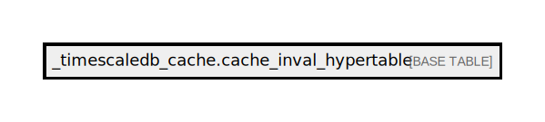

# _timescaledb_cache.cache_inval_hypertable

## Description

## Columns

| Name | Type | Default | Nullable | Children | Parents | Comment |
| ---- | ---- | ------- | -------- | -------- | ------- | ------- |

## Relations

---

> Generated by [tbls](https://github.com/k1LoW/tbls)
