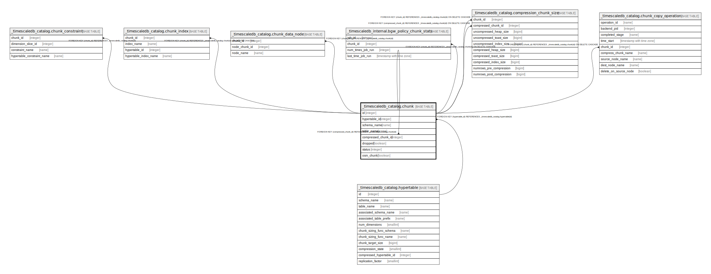

# _timescaledb_catalog.chunk

## Description

## Columns

| Name | Type | Default | Nullable | Children | Parents | Comment |
| ---- | ---- | ------- | -------- | -------- | ------- | ------- |
| id | integer | nextval('_timescaledb_catalog.chunk_id_seq'::regclass) | false | [_timescaledb_catalog.chunk](_timescaledb_catalog.chunk.md) [_timescaledb_catalog.chunk_constraint](_timescaledb_catalog.chunk_constraint.md) [_timescaledb_catalog.chunk_index](_timescaledb_catalog.chunk_index.md) [_timescaledb_catalog.chunk_data_node](_timescaledb_catalog.chunk_data_node.md) [_timescaledb_internal.bgw_policy_chunk_stats](_timescaledb_internal.bgw_policy_chunk_stats.md) [_timescaledb_catalog.compression_chunk_size](_timescaledb_catalog.compression_chunk_size.md) [_timescaledb_catalog.chunk_copy_operation](_timescaledb_catalog.chunk_copy_operation.md) |  |  |
| hypertable_id | integer |  | false |  | [_timescaledb_catalog.hypertable](_timescaledb_catalog.hypertable.md) |  |
| schema_name | name |  | false |  |  |  |
| table_name | name |  | false |  |  |  |
| compressed_chunk_id | integer |  | true |  | [_timescaledb_catalog.chunk](_timescaledb_catalog.chunk.md) |  |
| dropped | boolean | false | false |  |  |  |
| status | integer | 0 | false |  |  |  |
| osm_chunk | boolean | false | false |  |  |  |

## Constraints

| Name | Type | Definition |
| ---- | ---- | ---------- |
| chunk_hypertable_id_fkey | FOREIGN KEY | FOREIGN KEY (hypertable_id) REFERENCES _timescaledb_catalog.hypertable(id) |
| chunk_compressed_chunk_id_fkey | FOREIGN KEY | FOREIGN KEY (compressed_chunk_id) REFERENCES _timescaledb_catalog.chunk(id) |
| chunk_pkey | PRIMARY KEY | PRIMARY KEY (id) |
| chunk_schema_name_table_name_key | UNIQUE | UNIQUE (schema_name, table_name) |

## Indexes

| Name | Definition |
| ---- | ---------- |
| chunk_pkey | CREATE UNIQUE INDEX chunk_pkey ON _timescaledb_catalog.chunk USING btree (id) |
| chunk_schema_name_table_name_key | CREATE UNIQUE INDEX chunk_schema_name_table_name_key ON _timescaledb_catalog.chunk USING btree (schema_name, table_name) |
| chunk_hypertable_id_idx | CREATE INDEX chunk_hypertable_id_idx ON _timescaledb_catalog.chunk USING btree (hypertable_id) |
| chunk_compressed_chunk_id_idx | CREATE INDEX chunk_compressed_chunk_id_idx ON _timescaledb_catalog.chunk USING btree (compressed_chunk_id) |
| chunk_osm_chunk_idx | CREATE INDEX chunk_osm_chunk_idx ON _timescaledb_catalog.chunk USING btree (osm_chunk, hypertable_id) |

## Relations

---

> Generated by [tbls](https://github.com/k1LoW/tbls)
