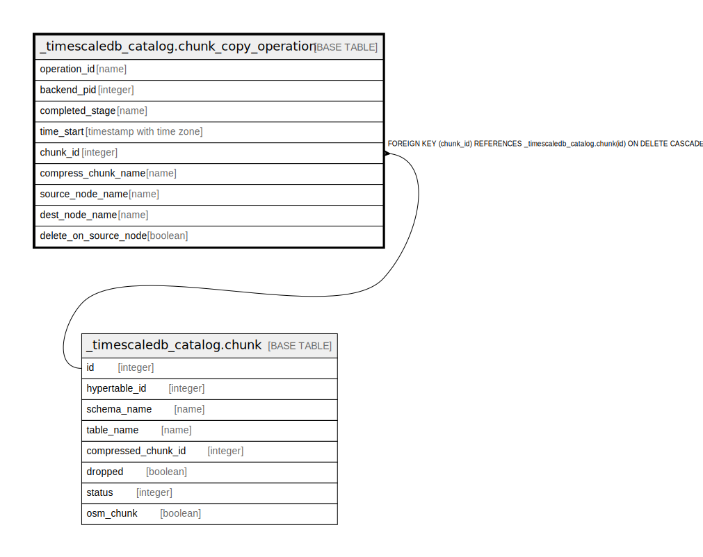

# _timescaledb_catalog.chunk_copy_operation

## Description

## Columns

| Name | Type | Default | Nullable | Children | Parents | Comment |
| ---- | ---- | ------- | -------- | -------- | ------- | ------- |
| operation_id | name |  | false |  |  |  |
| backend_pid | integer |  | false |  |  |  |
| completed_stage | name |  | false |  |  |  |
| time_start | timestamp with time zone | now() | false |  |  |  |
| chunk_id | integer |  | false |  | [_timescaledb_catalog.chunk](_timescaledb_catalog.chunk.md) |  |
| compress_chunk_name | name |  | false |  |  |  |
| source_node_name | name |  | false |  |  |  |
| dest_node_name | name |  | false |  |  |  |
| delete_on_source_node | boolean |  | false |  |  |  |

## Constraints

| Name | Type | Definition |
| ---- | ---- | ---------- |
| chunk_copy_operation_chunk_id_fkey | FOREIGN KEY | FOREIGN KEY (chunk_id) REFERENCES _timescaledb_catalog.chunk(id) ON DELETE CASCADE |
| chunk_copy_operation_pkey | PRIMARY KEY | PRIMARY KEY (operation_id) |

## Indexes

| Name | Definition |
| ---- | ---------- |
| chunk_copy_operation_pkey | CREATE UNIQUE INDEX chunk_copy_operation_pkey ON _timescaledb_catalog.chunk_copy_operation USING btree (operation_id) |

## Relations

---

> Generated by [tbls](https://github.com/k1LoW/tbls)
