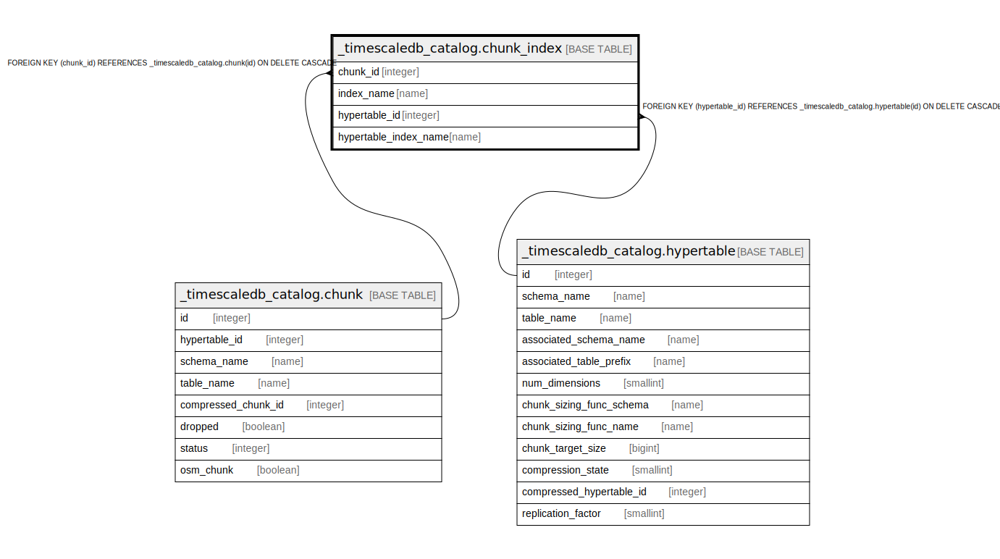

# _timescaledb_catalog.chunk_index

## Description

## Columns

| Name | Type | Default | Nullable | Children | Parents | Comment |
| ---- | ---- | ------- | -------- | -------- | ------- | ------- |
| chunk_id | integer |  | false |  | [_timescaledb_catalog.chunk](_timescaledb_catalog.chunk.md) |  |
| index_name | name |  | false |  |  |  |
| hypertable_id | integer |  | false |  | [_timescaledb_catalog.hypertable](_timescaledb_catalog.hypertable.md) |  |
| hypertable_index_name | name |  | false |  |  |  |

## Constraints

| Name | Type | Definition |
| ---- | ---- | ---------- |
| chunk_index_hypertable_id_fkey | FOREIGN KEY | FOREIGN KEY (hypertable_id) REFERENCES _timescaledb_catalog.hypertable(id) ON DELETE CASCADE |
| chunk_index_chunk_id_fkey | FOREIGN KEY | FOREIGN KEY (chunk_id) REFERENCES _timescaledb_catalog.chunk(id) ON DELETE CASCADE |
| chunk_index_chunk_id_index_name_key | UNIQUE | UNIQUE (chunk_id, index_name) |

## Indexes

| Name | Definition |
| ---- | ---------- |
| chunk_index_chunk_id_index_name_key | CREATE UNIQUE INDEX chunk_index_chunk_id_index_name_key ON _timescaledb_catalog.chunk_index USING btree (chunk_id, index_name) |
| chunk_index_hypertable_id_hypertable_index_name_idx | CREATE INDEX chunk_index_hypertable_id_hypertable_index_name_idx ON _timescaledb_catalog.chunk_index USING btree (hypertable_id, hypertable_index_name) |

## Relations

---

> Generated by [tbls](https://github.com/k1LoW/tbls)
