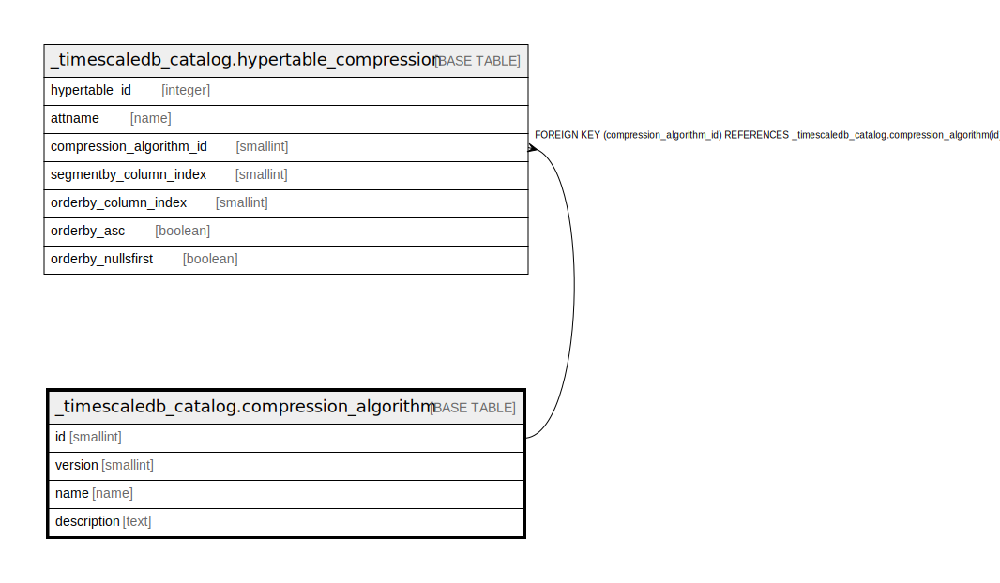

# _timescaledb_catalog.compression_algorithm

## Description

## Columns

| Name | Type | Default | Nullable | Children | Parents | Comment |
| ---- | ---- | ------- | -------- | -------- | ------- | ------- |
| id | smallint |  | false | [_timescaledb_catalog.hypertable_compression](_timescaledb_catalog.hypertable_compression.md) |  |  |
| version | smallint |  | false |  |  |  |
| name | name |  | false |  |  |  |
| description | text |  | true |  |  |  |

## Constraints

| Name | Type | Definition |
| ---- | ---- | ---------- |
| compression_algorithm_pkey | PRIMARY KEY | PRIMARY KEY (id) |

## Indexes

| Name | Definition |
| ---- | ---------- |
| compression_algorithm_pkey | CREATE UNIQUE INDEX compression_algorithm_pkey ON _timescaledb_catalog.compression_algorithm USING btree (id) |

## Relations

---

> Generated by [tbls](https://github.com/k1LoW/tbls)
