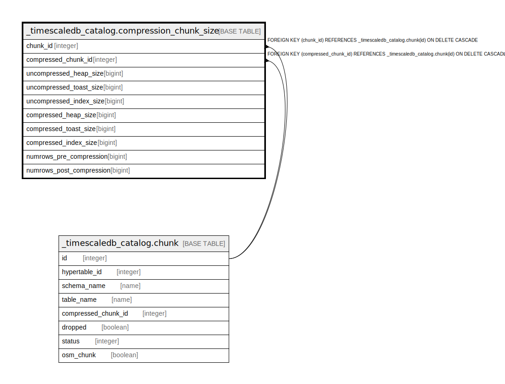

# _timescaledb_catalog.compression_chunk_size

## Description

## Columns

| Name | Type | Default | Nullable | Children | Parents | Comment |
| ---- | ---- | ------- | -------- | -------- | ------- | ------- |
| chunk_id | integer |  | false |  | [_timescaledb_catalog.chunk](_timescaledb_catalog.chunk.md) |  |
| compressed_chunk_id | integer |  | false |  | [_timescaledb_catalog.chunk](_timescaledb_catalog.chunk.md) |  |
| uncompressed_heap_size | bigint |  | false |  |  |  |
| uncompressed_toast_size | bigint |  | false |  |  |  |
| uncompressed_index_size | bigint |  | false |  |  |  |
| compressed_heap_size | bigint |  | false |  |  |  |
| compressed_toast_size | bigint |  | false |  |  |  |
| compressed_index_size | bigint |  | false |  |  |  |
| numrows_pre_compression | bigint |  | true |  |  |  |
| numrows_post_compression | bigint |  | true |  |  |  |

## Constraints

| Name | Type | Definition |
| ---- | ---- | ---------- |
| compression_chunk_size_chunk_id_fkey | FOREIGN KEY | FOREIGN KEY (chunk_id) REFERENCES _timescaledb_catalog.chunk(id) ON DELETE CASCADE |
| compression_chunk_size_compressed_chunk_id_fkey | FOREIGN KEY | FOREIGN KEY (compressed_chunk_id) REFERENCES _timescaledb_catalog.chunk(id) ON DELETE CASCADE |
| compression_chunk_size_pkey | PRIMARY KEY | PRIMARY KEY (chunk_id) |

## Indexes

| Name | Definition |
| ---- | ---------- |
| compression_chunk_size_pkey | CREATE UNIQUE INDEX compression_chunk_size_pkey ON _timescaledb_catalog.compression_chunk_size USING btree (chunk_id) |

## Relations

---

> Generated by [tbls](https://github.com/k1LoW/tbls)
