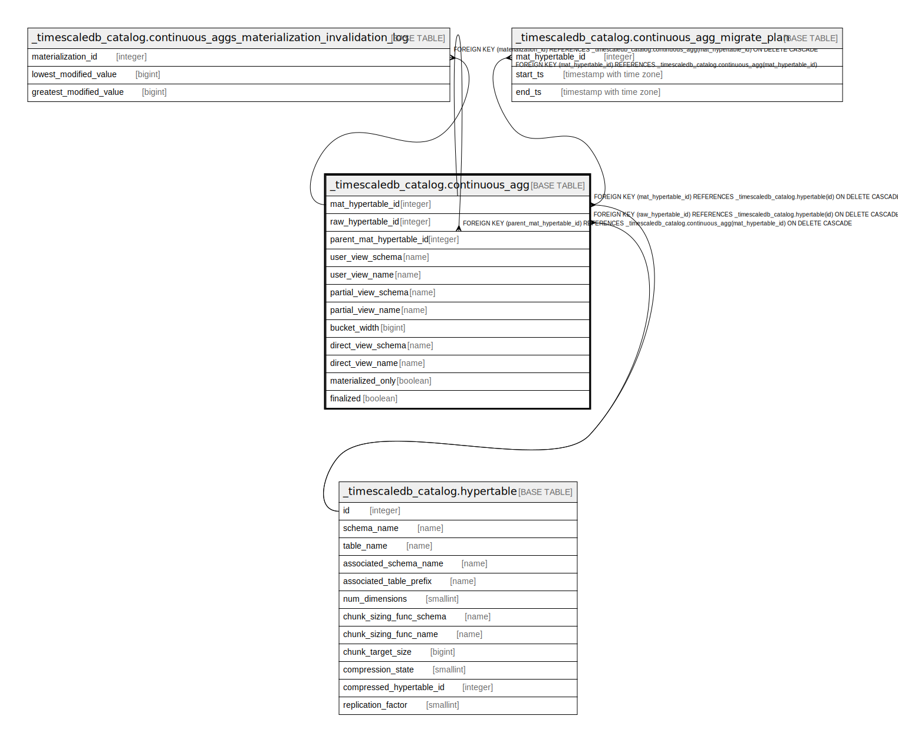

# _timescaledb_catalog.continuous_agg

## Description

## Columns

| Name | Type | Default | Nullable | Children | Parents | Comment |
| ---- | ---- | ------- | -------- | -------- | ------- | ------- |
| mat_hypertable_id | integer |  | false | [_timescaledb_catalog.continuous_agg](_timescaledb_catalog.continuous_agg.md) [_timescaledb_catalog.continuous_aggs_materialization_invalidation_log](_timescaledb_catalog.continuous_aggs_materialization_invalidation_log.md) [_timescaledb_catalog.continuous_agg_migrate_plan](_timescaledb_catalog.continuous_agg_migrate_plan.md) | [_timescaledb_catalog.hypertable](_timescaledb_catalog.hypertable.md) |  |
| raw_hypertable_id | integer |  | false |  | [_timescaledb_catalog.hypertable](_timescaledb_catalog.hypertable.md) |  |
| parent_mat_hypertable_id | integer |  | true |  | [_timescaledb_catalog.continuous_agg](_timescaledb_catalog.continuous_agg.md) |  |
| user_view_schema | name |  | false |  |  |  |
| user_view_name | name |  | false |  |  |  |
| partial_view_schema | name |  | false |  |  |  |
| partial_view_name | name |  | false |  |  |  |
| bucket_width | bigint |  | false |  |  |  |
| direct_view_schema | name |  | false |  |  |  |
| direct_view_name | name |  | false |  |  |  |
| materialized_only | boolean | false | false |  |  |  |
| finalized | boolean | true | false |  |  |  |

## Constraints

| Name | Type | Definition |
| ---- | ---- | ---------- |
| continuous_agg_mat_hypertable_id_fkey | FOREIGN KEY | FOREIGN KEY (mat_hypertable_id) REFERENCES _timescaledb_catalog.hypertable(id) ON DELETE CASCADE |
| continuous_agg_raw_hypertable_id_fkey | FOREIGN KEY | FOREIGN KEY (raw_hypertable_id) REFERENCES _timescaledb_catalog.hypertable(id) ON DELETE CASCADE |
| continuous_agg_parent_mat_hypertable_id_fkey | FOREIGN KEY | FOREIGN KEY (parent_mat_hypertable_id) REFERENCES _timescaledb_catalog.continuous_agg(mat_hypertable_id) ON DELETE CASCADE |
| continuous_agg_pkey | PRIMARY KEY | PRIMARY KEY (mat_hypertable_id) |
| continuous_agg_partial_view_schema_partial_view_name_key | UNIQUE | UNIQUE (partial_view_schema, partial_view_name) |
| continuous_agg_user_view_schema_user_view_name_key | UNIQUE | UNIQUE (user_view_schema, user_view_name) |

## Indexes

| Name | Definition |
| ---- | ---------- |
| continuous_agg_pkey | CREATE UNIQUE INDEX continuous_agg_pkey ON _timescaledb_catalog.continuous_agg USING btree (mat_hypertable_id) |
| continuous_agg_partial_view_schema_partial_view_name_key | CREATE UNIQUE INDEX continuous_agg_partial_view_schema_partial_view_name_key ON _timescaledb_catalog.continuous_agg USING btree (partial_view_schema, partial_view_name) |
| continuous_agg_user_view_schema_user_view_name_key | CREATE UNIQUE INDEX continuous_agg_user_view_schema_user_view_name_key ON _timescaledb_catalog.continuous_agg USING btree (user_view_schema, user_view_name) |
| continuous_agg_raw_hypertable_id_idx | CREATE INDEX continuous_agg_raw_hypertable_id_idx ON _timescaledb_catalog.continuous_agg USING btree (raw_hypertable_id) |

## Relations

---

> Generated by [tbls](https://github.com/k1LoW/tbls)
