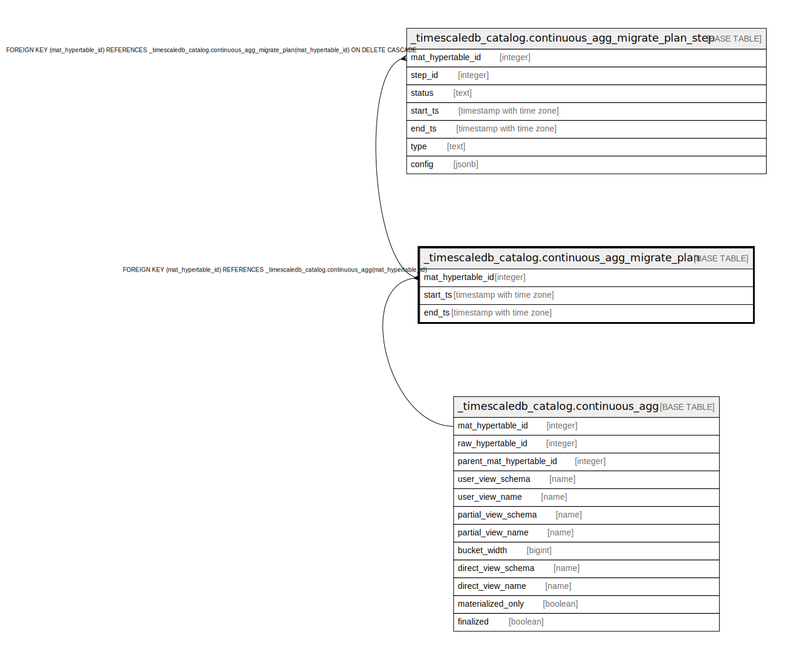

# _timescaledb_catalog.continuous_agg_migrate_plan

## Description

## Columns

| Name | Type | Default | Nullable | Children | Parents | Comment |
| ---- | ---- | ------- | -------- | -------- | ------- | ------- |
| mat_hypertable_id | integer |  | false | [_timescaledb_catalog.continuous_agg_migrate_plan_step](_timescaledb_catalog.continuous_agg_migrate_plan_step.md) | [_timescaledb_catalog.continuous_agg](_timescaledb_catalog.continuous_agg.md) |  |
| start_ts | timestamp with time zone | now() | false |  |  |  |
| end_ts | timestamp with time zone |  | true |  |  |  |

## Constraints

| Name | Type | Definition |
| ---- | ---- | ---------- |
| continuous_agg_migrate_plan_mat_hypertable_id_fkey | FOREIGN KEY | FOREIGN KEY (mat_hypertable_id) REFERENCES _timescaledb_catalog.continuous_agg(mat_hypertable_id) |
| continuous_agg_migrate_plan_pkey | PRIMARY KEY | PRIMARY KEY (mat_hypertable_id) |

## Indexes

| Name | Definition |
| ---- | ---------- |
| continuous_agg_migrate_plan_pkey | CREATE UNIQUE INDEX continuous_agg_migrate_plan_pkey ON _timescaledb_catalog.continuous_agg_migrate_plan USING btree (mat_hypertable_id) |

## Relations

---

> Generated by [tbls](https://github.com/k1LoW/tbls)
