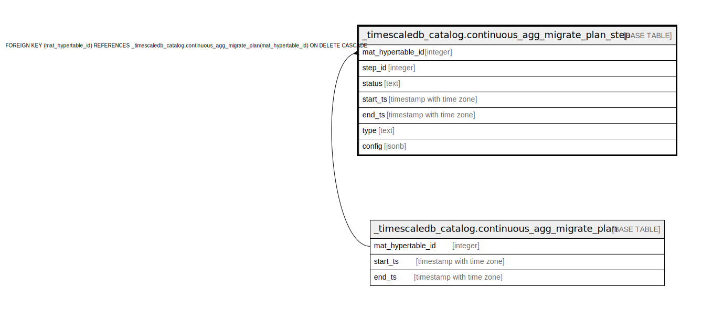

# _timescaledb_catalog.continuous_agg_migrate_plan_step

## Description

## Columns

| Name | Type | Default | Nullable | Children | Parents | Comment |
| ---- | ---- | ------- | -------- | -------- | ------- | ------- |
| mat_hypertable_id | integer |  | false |  | [_timescaledb_catalog.continuous_agg_migrate_plan](_timescaledb_catalog.continuous_agg_migrate_plan.md) |  |
| step_id | integer | nextval('_timescaledb_catalog.continuous_agg_migrate_plan_step_step_id_seq'::regclass) | false |  |  |  |
| status | text | 'NOT STARTED'::text | false |  |  |  |
| start_ts | timestamp with time zone |  | true |  |  |  |
| end_ts | timestamp with time zone |  | true |  |  |  |
| type | text |  | false |  |  |  |
| config | jsonb |  | true |  |  |  |

## Constraints

| Name | Type | Definition |
| ---- | ---- | ---------- |
| continuous_agg_migrate_plan_step_check | CHECK | CHECK ((start_ts <= end_ts)) |
| continuous_agg_migrate_plan_step_check2 | CHECK | CHECK ((type = ANY (ARRAY['CREATE NEW CAGG'::text, 'DISABLE POLICIES'::text, 'COPY POLICIES'::text, 'ENABLE POLICIES'::text, 'SAVE WATERMARK'::text, 'REFRESH NEW CAGG'::text, 'COPY DATA'::text, 'OVERRIDE CAGG'::text, 'DROP OLD CAGG'::text]))) |
| continuous_agg_migrate_plan_step_mat_hypertable_id_fkey | FOREIGN KEY | FOREIGN KEY (mat_hypertable_id) REFERENCES _timescaledb_catalog.continuous_agg_migrate_plan(mat_hypertable_id) ON DELETE CASCADE |
| continuous_agg_migrate_plan_step_pkey | PRIMARY KEY | PRIMARY KEY (mat_hypertable_id, step_id) |

## Indexes

| Name | Definition |
| ---- | ---------- |
| continuous_agg_migrate_plan_step_pkey | CREATE UNIQUE INDEX continuous_agg_migrate_plan_step_pkey ON _timescaledb_catalog.continuous_agg_migrate_plan_step USING btree (mat_hypertable_id, step_id) |

## Relations

---

> Generated by [tbls](https://github.com/k1LoW/tbls)
