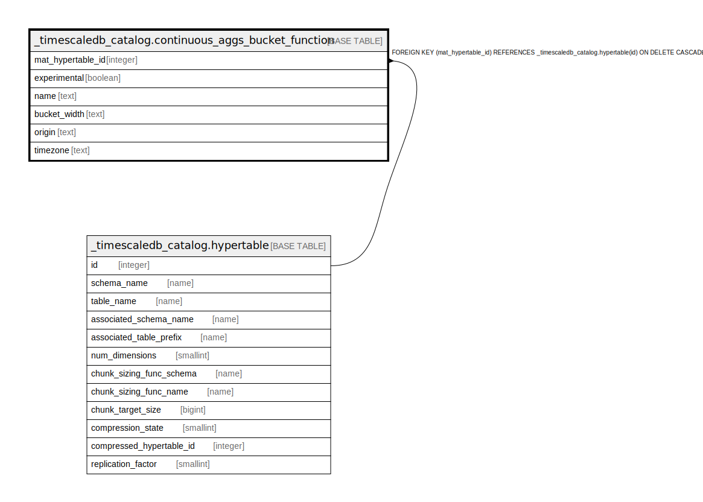

# _timescaledb_catalog.continuous_aggs_bucket_function

## Description

## Columns

| Name | Type | Default | Nullable | Children | Parents | Comment |
| ---- | ---- | ------- | -------- | -------- | ------- | ------- |
| mat_hypertable_id | integer |  | false |  | [_timescaledb_catalog.hypertable](_timescaledb_catalog.hypertable.md) |  |
| experimental | boolean |  | false |  |  |  |
| name | text |  | false |  |  |  |
| bucket_width | text |  | false |  |  |  |
| origin | text |  | false |  |  |  |
| timezone | text |  | false |  |  |  |

## Constraints

| Name | Type | Definition |
| ---- | ---- | ---------- |
| continuous_aggs_bucket_function_mat_hypertable_id_fkey | FOREIGN KEY | FOREIGN KEY (mat_hypertable_id) REFERENCES _timescaledb_catalog.hypertable(id) ON DELETE CASCADE |
| continuous_aggs_bucket_function_pkey | PRIMARY KEY | PRIMARY KEY (mat_hypertable_id) |

## Indexes

| Name | Definition |
| ---- | ---------- |
| continuous_aggs_bucket_function_pkey | CREATE UNIQUE INDEX continuous_aggs_bucket_function_pkey ON _timescaledb_catalog.continuous_aggs_bucket_function USING btree (mat_hypertable_id) |

## Relations

---

> Generated by [tbls](https://github.com/k1LoW/tbls)
