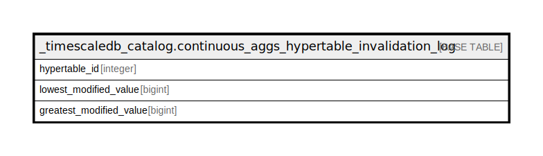

# _timescaledb_catalog.continuous_aggs_hypertable_invalidation_log

## Description

## Columns

| Name | Type | Default | Nullable | Children | Parents | Comment |
| ---- | ---- | ------- | -------- | -------- | ------- | ------- |
| hypertable_id | integer |  | false |  |  |  |
| lowest_modified_value | bigint |  | false |  |  |  |
| greatest_modified_value | bigint |  | false |  |  |  |

## Indexes

| Name | Definition |
| ---- | ---------- |
| continuous_aggs_hypertable_invalidation_log_idx | CREATE INDEX continuous_aggs_hypertable_invalidation_log_idx ON _timescaledb_catalog.continuous_aggs_hypertable_invalidation_log USING btree (hypertable_id, lowest_modified_value) |

## Relations

---

> Generated by [tbls](https://github.com/k1LoW/tbls)
