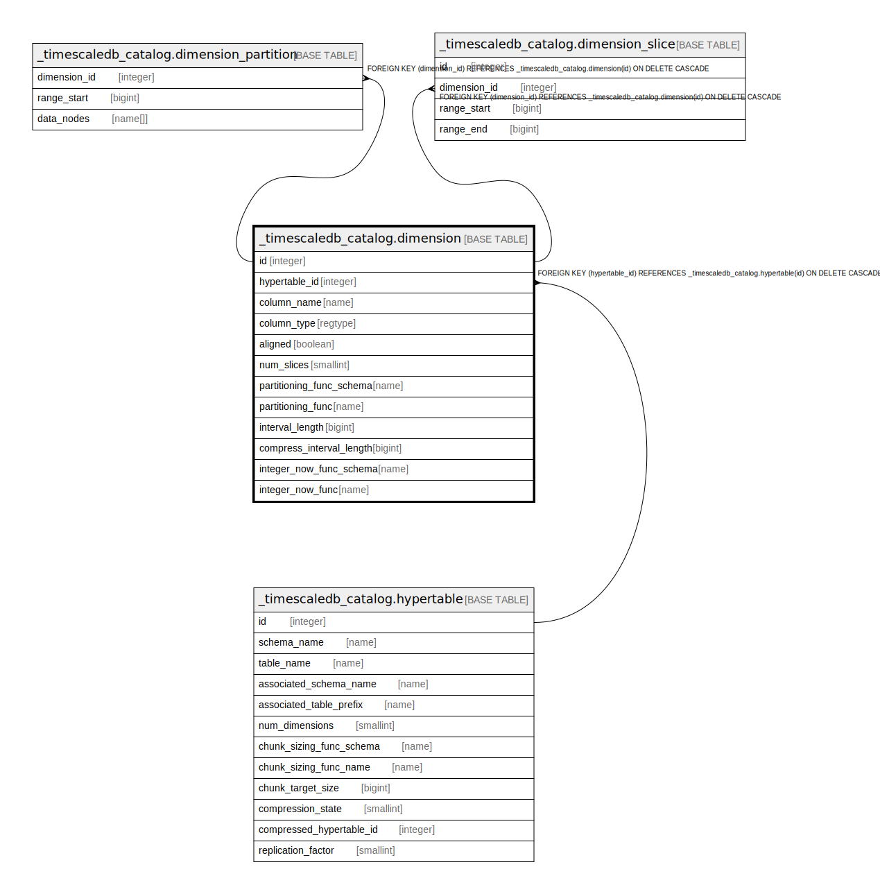

# _timescaledb_catalog.dimension

## Description

## Columns

| Name | Type | Default | Nullable | Children | Parents | Comment |
| ---- | ---- | ------- | -------- | -------- | ------- | ------- |
| id | integer | nextval('_timescaledb_catalog.dimension_id_seq'::regclass) | false | [_timescaledb_catalog.dimension_partition](_timescaledb_catalog.dimension_partition.md) [_timescaledb_catalog.dimension_slice](_timescaledb_catalog.dimension_slice.md) |  |  |
| hypertable_id | integer |  | false |  | [_timescaledb_catalog.hypertable](_timescaledb_catalog.hypertable.md) |  |
| column_name | name |  | false |  |  |  |
| column_type | regtype |  | false |  |  |  |
| aligned | boolean |  | false |  |  |  |
| num_slices | smallint |  | true |  |  |  |
| partitioning_func_schema | name |  | true |  |  |  |
| partitioning_func | name |  | true |  |  |  |
| interval_length | bigint |  | true |  |  |  |
| compress_interval_length | bigint |  | true |  |  |  |
| integer_now_func_schema | name |  | true |  |  |  |
| integer_now_func | name |  | true |  |  |  |

## Constraints

| Name | Type | Definition |
| ---- | ---- | ---------- |
| dimension_check | CHECK | CHECK ((((partitioning_func_schema IS NULL) AND (partitioning_func IS NULL)) OR ((partitioning_func_schema IS NOT NULL) AND (partitioning_func IS NOT NULL)))) |
| dimension_check1 | CHECK | CHECK ((((num_slices IS NULL) AND (interval_length IS NOT NULL)) OR ((num_slices IS NOT NULL) AND (interval_length IS NULL)))) |
| dimension_check2 | CHECK | CHECK ((((integer_now_func_schema IS NULL) AND (integer_now_func IS NULL)) OR ((integer_now_func_schema IS NOT NULL) AND (integer_now_func IS NOT NULL)))) |
| dimension_compress_interval_length_check | CHECK | CHECK (((compress_interval_length IS NULL) OR (compress_interval_length > 0))) |
| dimension_interval_length_check | CHECK | CHECK (((interval_length IS NULL) OR (interval_length > 0))) |
| dimension_hypertable_id_fkey | FOREIGN KEY | FOREIGN KEY (hypertable_id) REFERENCES _timescaledb_catalog.hypertable(id) ON DELETE CASCADE |
| dimension_pkey | PRIMARY KEY | PRIMARY KEY (id) |
| dimension_hypertable_id_column_name_key | UNIQUE | UNIQUE (hypertable_id, column_name) |

## Indexes

| Name | Definition |
| ---- | ---------- |
| dimension_pkey | CREATE UNIQUE INDEX dimension_pkey ON _timescaledb_catalog.dimension USING btree (id) |
| dimension_hypertable_id_column_name_key | CREATE UNIQUE INDEX dimension_hypertable_id_column_name_key ON _timescaledb_catalog.dimension USING btree (hypertable_id, column_name) |

## Relations

---

> Generated by [tbls](https://github.com/k1LoW/tbls)
