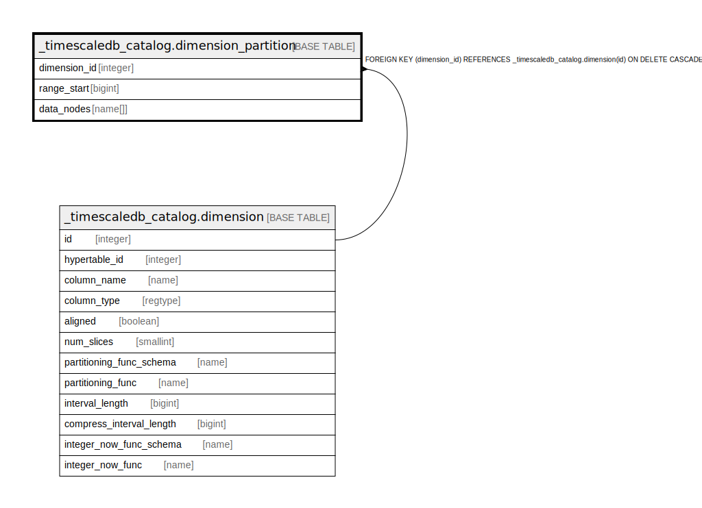

# _timescaledb_catalog.dimension_partition

## Description

## Columns

| Name | Type | Default | Nullable | Children | Parents | Comment |
| ---- | ---- | ------- | -------- | -------- | ------- | ------- |
| dimension_id | integer |  | false |  | [_timescaledb_catalog.dimension](_timescaledb_catalog.dimension.md) |  |
| range_start | bigint |  | false |  |  |  |
| data_nodes | name[] |  | true |  |  |  |

## Constraints

| Name | Type | Definition |
| ---- | ---- | ---------- |
| dimension_partition_dimension_id_fkey | FOREIGN KEY | FOREIGN KEY (dimension_id) REFERENCES _timescaledb_catalog.dimension(id) ON DELETE CASCADE |
| dimension_partition_dimension_id_range_start_key | UNIQUE | UNIQUE (dimension_id, range_start) |

## Indexes

| Name | Definition |
| ---- | ---------- |
| dimension_partition_dimension_id_range_start_key | CREATE UNIQUE INDEX dimension_partition_dimension_id_range_start_key ON _timescaledb_catalog.dimension_partition USING btree (dimension_id, range_start) |

## Relations

---

> Generated by [tbls](https://github.com/k1LoW/tbls)
