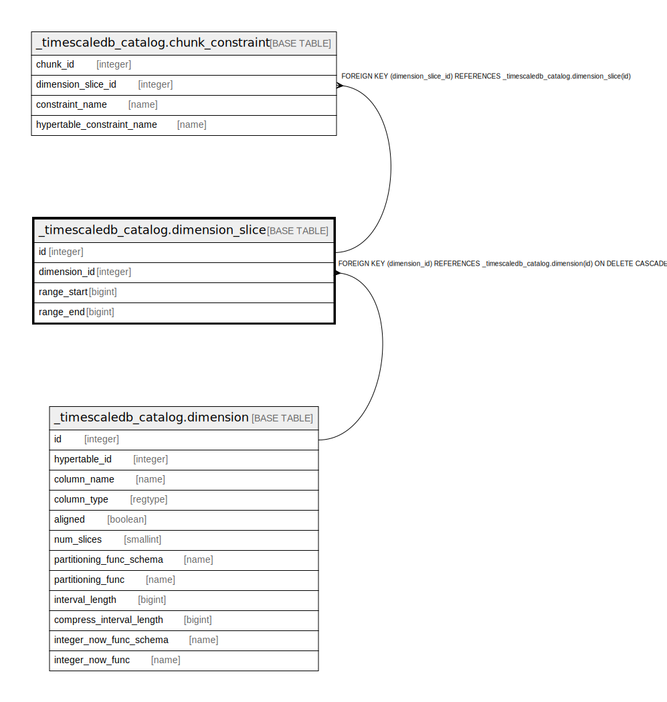

# _timescaledb_catalog.dimension_slice

## Description

## Columns

| Name | Type | Default | Nullable | Children | Parents | Comment |
| ---- | ---- | ------- | -------- | -------- | ------- | ------- |
| id | integer | nextval('_timescaledb_catalog.dimension_slice_id_seq'::regclass) | false | [_timescaledb_catalog.chunk_constraint](_timescaledb_catalog.chunk_constraint.md) |  |  |
| dimension_id | integer |  | false |  | [_timescaledb_catalog.dimension](_timescaledb_catalog.dimension.md) |  |
| range_start | bigint |  | false |  |  |  |
| range_end | bigint |  | false |  |  |  |

## Constraints

| Name | Type | Definition |
| ---- | ---- | ---------- |
| dimension_slice_check | CHECK | CHECK ((range_start <= range_end)) |
| dimension_slice_dimension_id_fkey | FOREIGN KEY | FOREIGN KEY (dimension_id) REFERENCES _timescaledb_catalog.dimension(id) ON DELETE CASCADE |
| dimension_slice_pkey | PRIMARY KEY | PRIMARY KEY (id) |
| dimension_slice_dimension_id_range_start_range_end_key | UNIQUE | UNIQUE (dimension_id, range_start, range_end) |

## Indexes

| Name | Definition |
| ---- | ---------- |
| dimension_slice_pkey | CREATE UNIQUE INDEX dimension_slice_pkey ON _timescaledb_catalog.dimension_slice USING btree (id) |
| dimension_slice_dimension_id_range_start_range_end_key | CREATE UNIQUE INDEX dimension_slice_dimension_id_range_start_range_end_key ON _timescaledb_catalog.dimension_slice USING btree (dimension_id, range_start, range_end) |

## Relations

---

> Generated by [tbls](https://github.com/k1LoW/tbls)
