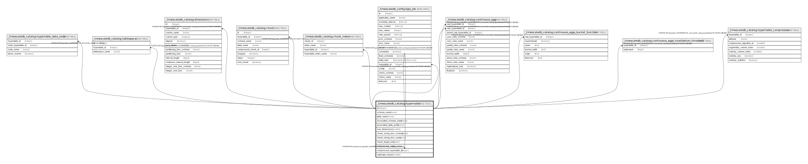

# _timescaledb_catalog.hypertable

## Description

## Columns

| Name | Type | Default | Nullable | Children | Parents | Comment |
| ---- | ---- | ------- | -------- | -------- | ------- | ------- |
| id | integer | nextval('_timescaledb_catalog.hypertable_id_seq'::regclass) | false | [_timescaledb_catalog.hypertable](_timescaledb_catalog.hypertable.md) [_timescaledb_catalog.hypertable_data_node](_timescaledb_catalog.hypertable_data_node.md) [_timescaledb_catalog.tablespace](_timescaledb_catalog.tablespace.md) [_timescaledb_catalog.dimension](_timescaledb_catalog.dimension.md) [_timescaledb_catalog.chunk](_timescaledb_catalog.chunk.md) [_timescaledb_catalog.chunk_index](_timescaledb_catalog.chunk_index.md) [_timescaledb_config.bgw_job](_timescaledb_config.bgw_job.md) [_timescaledb_catalog.continuous_agg](_timescaledb_catalog.continuous_agg.md) [_timescaledb_catalog.continuous_aggs_bucket_function](_timescaledb_catalog.continuous_aggs_bucket_function.md) [_timescaledb_catalog.continuous_aggs_invalidation_threshold](_timescaledb_catalog.continuous_aggs_invalidation_threshold.md) [_timescaledb_catalog.hypertable_compression](_timescaledb_catalog.hypertable_compression.md) |  |  |
| schema_name | name |  | false |  |  |  |
| table_name | name |  | false |  |  |  |
| associated_schema_name | name |  | false |  |  |  |
| associated_table_prefix | name |  | false |  |  |  |
| num_dimensions | smallint |  | false |  |  |  |
| chunk_sizing_func_schema | name |  | false |  |  |  |
| chunk_sizing_func_name | name |  | false |  |  |  |
| chunk_target_size | bigint |  | false |  |  |  |
| compression_state | smallint | 0 | false |  |  |  |
| compressed_hypertable_id | integer |  | true |  | [_timescaledb_catalog.hypertable](_timescaledb_catalog.hypertable.md) |  |
| replication_factor | smallint |  | true |  |  |  |

## Constraints

| Name | Type | Definition |
| ---- | ---- | ---------- |
| hypertable_chunk_target_size_check | CHECK | CHECK ((chunk_target_size >= 0)) |
| hypertable_compress_check | CHECK | CHECK (((compression_state = 0) OR (compression_state = 1) OR ((compression_state = 2) AND (compressed_hypertable_id IS NULL)))) |
| hypertable_dim_compress_check | CHECK | CHECK (((num_dimensions > 0) OR (compression_state = 2))) |
| hypertable_replication_factor_check | CHECK | CHECK (((replication_factor > 0) OR (replication_factor = '-1'::integer))) |
| hypertable_schema_name_check | CHECK | CHECK ((schema_name <> '_timescaledb_catalog'::name)) |
| hypertable_compressed_hypertable_id_fkey | FOREIGN KEY | FOREIGN KEY (compressed_hypertable_id) REFERENCES _timescaledb_catalog.hypertable(id) |
| hypertable_pkey | PRIMARY KEY | PRIMARY KEY (id) |
| hypertable_associated_schema_name_associated_table_prefix_key | UNIQUE | UNIQUE (associated_schema_name, associated_table_prefix) |
| hypertable_table_name_schema_name_key | UNIQUE | UNIQUE (table_name, schema_name) |

## Indexes

| Name | Definition |
| ---- | ---------- |
| hypertable_pkey | CREATE UNIQUE INDEX hypertable_pkey ON _timescaledb_catalog.hypertable USING btree (id) |
| hypertable_associated_schema_name_associated_table_prefix_key | CREATE UNIQUE INDEX hypertable_associated_schema_name_associated_table_prefix_key ON _timescaledb_catalog.hypertable USING btree (associated_schema_name, associated_table_prefix) |
| hypertable_table_name_schema_name_key | CREATE UNIQUE INDEX hypertable_table_name_schema_name_key ON _timescaledb_catalog.hypertable USING btree (table_name, schema_name) |

## Relations

---

> Generated by [tbls](https://github.com/k1LoW/tbls)
