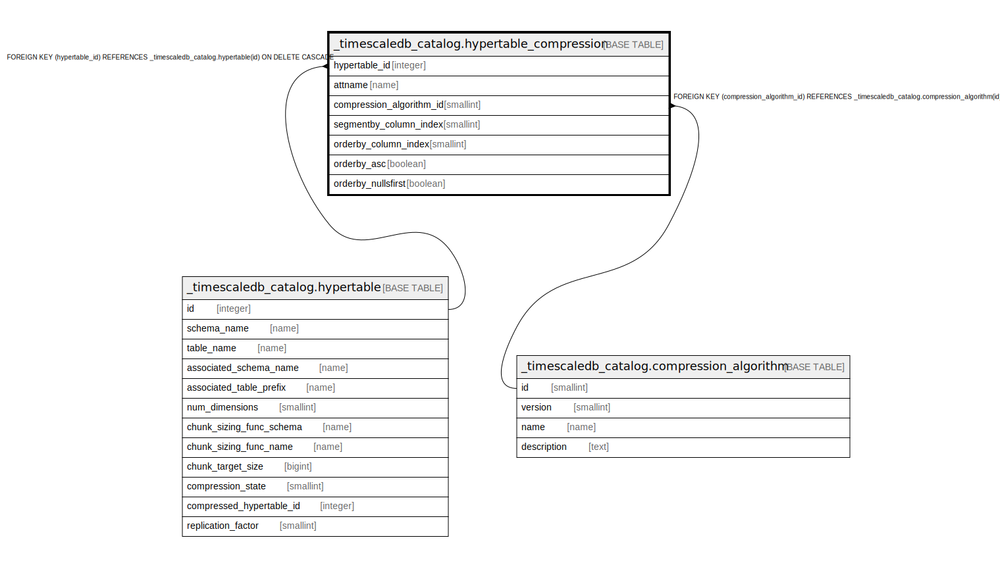

# _timescaledb_catalog.hypertable_compression

## Description

## Columns

| Name | Type | Default | Nullable | Children | Parents | Comment |
| ---- | ---- | ------- | -------- | -------- | ------- | ------- |
| hypertable_id | integer |  | false |  | [_timescaledb_catalog.hypertable](_timescaledb_catalog.hypertable.md) |  |
| attname | name |  | false |  |  |  |
| compression_algorithm_id | smallint |  | true |  | [_timescaledb_catalog.compression_algorithm](_timescaledb_catalog.compression_algorithm.md) |  |
| segmentby_column_index | smallint |  | true |  |  |  |
| orderby_column_index | smallint |  | true |  |  |  |
| orderby_asc | boolean |  | true |  |  |  |
| orderby_nullsfirst | boolean |  | true |  |  |  |

## Constraints

| Name | Type | Definition |
| ---- | ---- | ---------- |
| hypertable_compression_hypertable_id_fkey | FOREIGN KEY | FOREIGN KEY (hypertable_id) REFERENCES _timescaledb_catalog.hypertable(id) ON DELETE CASCADE |
| hypertable_compression_compression_algorithm_id_fkey | FOREIGN KEY | FOREIGN KEY (compression_algorithm_id) REFERENCES _timescaledb_catalog.compression_algorithm(id) |
| hypertable_compression_pkey | PRIMARY KEY | PRIMARY KEY (hypertable_id, attname) |
| hypertable_compression_hypertable_id_orderby_column_index_key | UNIQUE | UNIQUE (hypertable_id, orderby_column_index) |
| hypertable_compression_hypertable_id_segmentby_column_index_key | UNIQUE | UNIQUE (hypertable_id, segmentby_column_index) |

## Indexes

| Name | Definition |
| ---- | ---------- |
| hypertable_compression_pkey | CREATE UNIQUE INDEX hypertable_compression_pkey ON _timescaledb_catalog.hypertable_compression USING btree (hypertable_id, attname) |
| hypertable_compression_hypertable_id_orderby_column_index_key | CREATE UNIQUE INDEX hypertable_compression_hypertable_id_orderby_column_index_key ON _timescaledb_catalog.hypertable_compression USING btree (hypertable_id, orderby_column_index) |
| hypertable_compression_hypertable_id_segmentby_column_index_key | CREATE UNIQUE INDEX hypertable_compression_hypertable_id_segmentby_column_index_key ON _timescaledb_catalog.hypertable_compression USING btree (hypertable_id, segmentby_column_index) |

## Relations

---

> Generated by [tbls](https://github.com/k1LoW/tbls)
