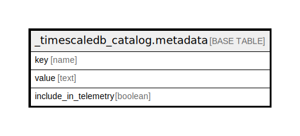

# _timescaledb_catalog.metadata

## Description

## Columns

| Name | Type | Default | Nullable | Children | Parents | Comment |
| ---- | ---- | ------- | -------- | -------- | ------- | ------- |
| key | name |  | false |  |  |  |
| value | text |  | false |  |  |  |
| include_in_telemetry | boolean |  | false |  |  |  |

## Constraints

| Name | Type | Definition |
| ---- | ---- | ---------- |
| metadata_pkey | PRIMARY KEY | PRIMARY KEY (key) |

## Indexes

| Name | Definition |
| ---- | ---------- |
| metadata_pkey | CREATE UNIQUE INDEX metadata_pkey ON _timescaledb_catalog.metadata USING btree (key) |

## Relations

---

> Generated by [tbls](https://github.com/k1LoW/tbls)
