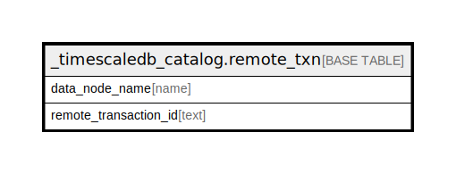

# _timescaledb_catalog.remote_txn

## Description

## Columns

| Name | Type | Default | Nullable | Children | Parents | Comment |
| ---- | ---- | ------- | -------- | -------- | ------- | ------- |
| data_node_name | name |  | true |  |  |  |
| remote_transaction_id | text |  | false |  |  |  |

## Constraints

| Name | Type | Definition |
| ---- | ---- | ---------- |
| remote_txn_remote_transaction_id_check | CHECK | CHECK (((remote_transaction_id)::rxid IS NOT NULL)) |
| remote_txn_pkey | PRIMARY KEY | PRIMARY KEY (remote_transaction_id) |

## Indexes

| Name | Definition |
| ---- | ---------- |
| remote_txn_pkey | CREATE UNIQUE INDEX remote_txn_pkey ON _timescaledb_catalog.remote_txn USING btree (remote_transaction_id) |
| remote_txn_data_node_name_idx | CREATE INDEX remote_txn_data_node_name_idx ON _timescaledb_catalog.remote_txn USING btree (data_node_name) |

## Relations

---

> Generated by [tbls](https://github.com/k1LoW/tbls)
