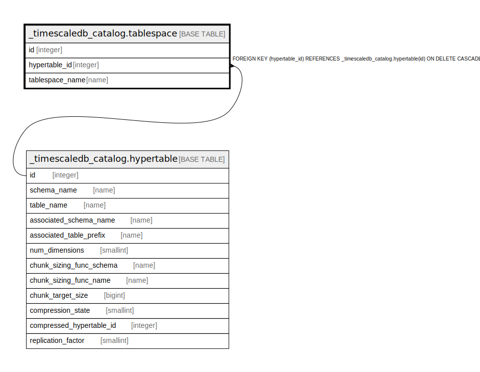

# _timescaledb_catalog.tablespace

## Description

## Columns

| Name | Type | Default | Nullable | Children | Parents | Comment |
| ---- | ---- | ------- | -------- | -------- | ------- | ------- |
| id | integer | nextval('_timescaledb_catalog.tablespace_id_seq'::regclass) | false |  |  |  |
| hypertable_id | integer |  | false |  | [_timescaledb_catalog.hypertable](_timescaledb_catalog.hypertable.md) |  |
| tablespace_name | name |  | false |  |  |  |

## Constraints

| Name | Type | Definition |
| ---- | ---- | ---------- |
| tablespace_hypertable_id_fkey | FOREIGN KEY | FOREIGN KEY (hypertable_id) REFERENCES _timescaledb_catalog.hypertable(id) ON DELETE CASCADE |
| tablespace_pkey | PRIMARY KEY | PRIMARY KEY (id) |
| tablespace_hypertable_id_tablespace_name_key | UNIQUE | UNIQUE (hypertable_id, tablespace_name) |

## Indexes

| Name | Definition |
| ---- | ---------- |
| tablespace_pkey | CREATE UNIQUE INDEX tablespace_pkey ON _timescaledb_catalog.tablespace USING btree (id) |
| tablespace_hypertable_id_tablespace_name_key | CREATE UNIQUE INDEX tablespace_hypertable_id_tablespace_name_key ON _timescaledb_catalog.tablespace USING btree (hypertable_id, tablespace_name) |

## Relations

---

> Generated by [tbls](https://github.com/k1LoW/tbls)
