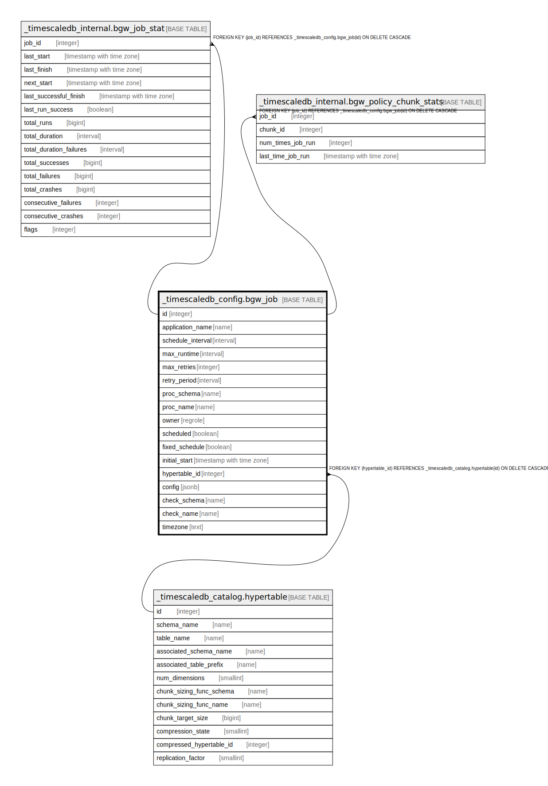

# _timescaledb_config.bgw_job

## Description

## Columns

| Name | Type | Default | Nullable | Children | Parents | Comment |
| ---- | ---- | ------- | -------- | -------- | ------- | ------- |
| id | integer | nextval('_timescaledb_config.bgw_job_id_seq'::regclass) | false | [_timescaledb_internal.bgw_job_stat](_timescaledb_internal.bgw_job_stat.md) [_timescaledb_internal.bgw_policy_chunk_stats](_timescaledb_internal.bgw_policy_chunk_stats.md) |  |  |
| application_name | name |  | false |  |  |  |
| schedule_interval | interval |  | false |  |  |  |
| max_runtime | interval |  | false |  |  |  |
| max_retries | integer |  | false |  |  |  |
| retry_period | interval |  | false |  |  |  |
| proc_schema | name |  | false |  |  |  |
| proc_name | name |  | false |  |  |  |
| owner | regrole | (CURRENT_ROLE)::regrole | false |  |  |  |
| scheduled | boolean | true | false |  |  |  |
| fixed_schedule | boolean | true | false |  |  |  |
| initial_start | timestamp with time zone |  | true |  |  |  |
| hypertable_id | integer |  | true |  | [_timescaledb_catalog.hypertable](_timescaledb_catalog.hypertable.md) |  |
| config | jsonb |  | true |  |  |  |
| check_schema | name |  | true |  |  |  |
| check_name | name |  | true |  |  |  |
| timezone | text |  | true |  |  |  |

## Constraints

| Name | Type | Definition |
| ---- | ---- | ---------- |
| bgw_job_hypertable_id_fkey | FOREIGN KEY | FOREIGN KEY (hypertable_id) REFERENCES _timescaledb_catalog.hypertable(id) ON DELETE CASCADE |
| bgw_job_pkey | PRIMARY KEY | PRIMARY KEY (id) |

## Indexes

| Name | Definition |
| ---- | ---------- |
| bgw_job_pkey | CREATE UNIQUE INDEX bgw_job_pkey ON _timescaledb_config.bgw_job USING btree (id) |
| bgw_job_proc_hypertable_id_idx | CREATE INDEX bgw_job_proc_hypertable_id_idx ON _timescaledb_config.bgw_job USING btree (proc_schema, proc_name, hypertable_id) |

## Relations

---

> Generated by [tbls](https://github.com/k1LoW/tbls)
