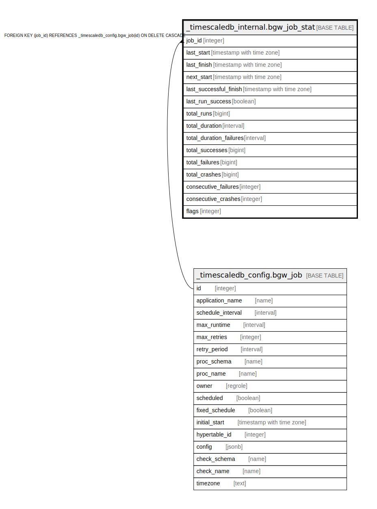

# _timescaledb_internal.bgw_job_stat

## Description

## Columns

| Name | Type | Default | Nullable | Children | Parents | Comment |
| ---- | ---- | ------- | -------- | -------- | ------- | ------- |
| job_id | integer |  | false |  | [_timescaledb_config.bgw_job](_timescaledb_config.bgw_job.md) |  |
| last_start | timestamp with time zone | now() | false |  |  |  |
| last_finish | timestamp with time zone |  | false |  |  |  |
| next_start | timestamp with time zone |  | false |  |  |  |
| last_successful_finish | timestamp with time zone |  | false |  |  |  |
| last_run_success | boolean |  | false |  |  |  |
| total_runs | bigint |  | false |  |  |  |
| total_duration | interval |  | false |  |  |  |
| total_duration_failures | interval |  | false |  |  |  |
| total_successes | bigint |  | false |  |  |  |
| total_failures | bigint |  | false |  |  |  |
| total_crashes | bigint |  | false |  |  |  |
| consecutive_failures | integer |  | false |  |  |  |
| consecutive_crashes | integer |  | false |  |  |  |
| flags | integer | 0 | false |  |  |  |

## Constraints

| Name | Type | Definition |
| ---- | ---- | ---------- |
| bgw_job_stat_job_id_fkey | FOREIGN KEY | FOREIGN KEY (job_id) REFERENCES _timescaledb_config.bgw_job(id) ON DELETE CASCADE |
| bgw_job_stat_pkey | PRIMARY KEY | PRIMARY KEY (job_id) |

## Indexes

| Name | Definition |
| ---- | ---------- |
| bgw_job_stat_pkey | CREATE UNIQUE INDEX bgw_job_stat_pkey ON _timescaledb_internal.bgw_job_stat USING btree (job_id) |

## Relations

---

> Generated by [tbls](https://github.com/k1LoW/tbls)
