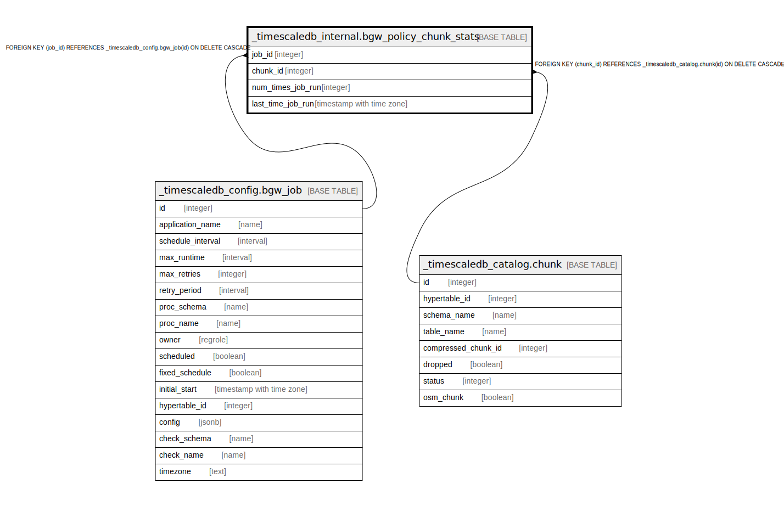

# _timescaledb_internal.bgw_policy_chunk_stats

## Description

## Columns

| Name | Type | Default | Nullable | Children | Parents | Comment |
| ---- | ---- | ------- | -------- | -------- | ------- | ------- |
| job_id | integer |  | false |  | [_timescaledb_config.bgw_job](_timescaledb_config.bgw_job.md) |  |
| chunk_id | integer |  | false |  | [_timescaledb_catalog.chunk](_timescaledb_catalog.chunk.md) |  |
| num_times_job_run | integer |  | true |  |  |  |
| last_time_job_run | timestamp with time zone |  | true |  |  |  |

## Constraints

| Name | Type | Definition |
| ---- | ---- | ---------- |
| bgw_policy_chunk_stats_chunk_id_fkey | FOREIGN KEY | FOREIGN KEY (chunk_id) REFERENCES _timescaledb_catalog.chunk(id) ON DELETE CASCADE |
| bgw_policy_chunk_stats_job_id_fkey | FOREIGN KEY | FOREIGN KEY (job_id) REFERENCES _timescaledb_config.bgw_job(id) ON DELETE CASCADE |
| bgw_policy_chunk_stats_job_id_chunk_id_key | UNIQUE | UNIQUE (job_id, chunk_id) |

## Indexes

| Name | Definition |
| ---- | ---------- |
| bgw_policy_chunk_stats_job_id_chunk_id_key | CREATE UNIQUE INDEX bgw_policy_chunk_stats_job_id_chunk_id_key ON _timescaledb_internal.bgw_policy_chunk_stats USING btree (job_id, chunk_id) |

## Relations

---

> Generated by [tbls](https://github.com/k1LoW/tbls)
