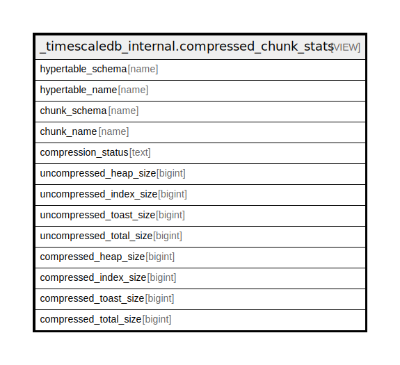

# _timescaledb_internal.compressed_chunk_stats

## Description

<details>
<summary><strong>Table Definition</strong></summary>

```sql
CREATE VIEW compressed_chunk_stats AS (
 SELECT srcht.schema_name AS hypertable_schema,
    srcht.table_name AS hypertable_name,
    srcch.schema_name AS chunk_schema,
    srcch.table_name AS chunk_name,
        CASE
            WHEN (srcch.compressed_chunk_id IS NULL) THEN 'Uncompressed'::text
            ELSE 'Compressed'::text
        END AS compression_status,
    map.uncompressed_heap_size,
    map.uncompressed_index_size,
    map.uncompressed_toast_size,
    ((map.uncompressed_heap_size + map.uncompressed_toast_size) + map.uncompressed_index_size) AS uncompressed_total_size,
    map.compressed_heap_size,
    map.compressed_index_size,
    map.compressed_toast_size,
    ((map.compressed_heap_size + map.compressed_toast_size) + map.compressed_index_size) AS compressed_total_size
   FROM ((_timescaledb_catalog.hypertable srcht
     JOIN _timescaledb_catalog.chunk srcch ON (((srcht.id = srcch.hypertable_id) AND (srcht.compressed_hypertable_id IS NOT NULL) AND (srcch.dropped = false))))
     LEFT JOIN _timescaledb_catalog.compression_chunk_size map ON ((srcch.id = map.chunk_id)))
)
```

</details>

## Referenced Tables

- [_timescaledb_catalog.hypertable](_timescaledb_catalog.hypertable.md)
- [_timescaledb_catalog.chunk](_timescaledb_catalog.chunk.md)
- [_timescaledb_catalog.compression_chunk_size](_timescaledb_catalog.compression_chunk_size.md)

## Columns

| Name | Type | Default | Nullable | Children | Parents | Comment |
| ---- | ---- | ------- | -------- | -------- | ------- | ------- |
| hypertable_schema | name |  | true |  |  |  |
| hypertable_name | name |  | true |  |  |  |
| chunk_schema | name |  | true |  |  |  |
| chunk_name | name |  | true |  |  |  |
| compression_status | text |  | true |  |  |  |
| uncompressed_heap_size | bigint |  | true |  |  |  |
| uncompressed_index_size | bigint |  | true |  |  |  |
| uncompressed_toast_size | bigint |  | true |  |  |  |
| uncompressed_total_size | bigint |  | true |  |  |  |
| compressed_heap_size | bigint |  | true |  |  |  |
| compressed_index_size | bigint |  | true |  |  |  |
| compressed_toast_size | bigint |  | true |  |  |  |
| compressed_total_size | bigint |  | true |  |  |  |

## Relations



---

> Generated by [tbls](https://github.com/k1LoW/tbls)
