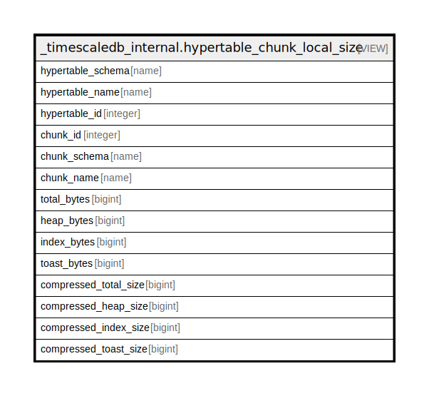

# _timescaledb_internal.hypertable_chunk_local_size

## Description

<details>
<summary><strong>Table Definition</strong></summary>

```sql
CREATE VIEW hypertable_chunk_local_size AS (
 SELECT h.schema_name AS hypertable_schema,
    h.table_name AS hypertable_name,
    h.id AS hypertable_id,
    c.id AS chunk_id,
    c.schema_name AS chunk_schema,
    c.table_name AS chunk_name,
    COALESCE(relsize.total_size, (0)::bigint) AS total_bytes,
    COALESCE(relsize.heap_size, (0)::bigint) AS heap_bytes,
    COALESCE(relsize.index_size, (0)::bigint) AS index_bytes,
    COALESCE(relsize.toast_size, (0)::bigint) AS toast_bytes,
    COALESCE(relcompsize.total_size, (0)::bigint) AS compressed_total_size,
    COALESCE(relcompsize.heap_size, (0)::bigint) AS compressed_heap_size,
    COALESCE(relcompsize.index_size, (0)::bigint) AS compressed_index_size,
    COALESCE(relcompsize.toast_size, (0)::bigint) AS compressed_toast_size
   FROM ((((_timescaledb_catalog.hypertable h
     JOIN _timescaledb_catalog.chunk c ON (((h.id = c.hypertable_id) AND (c.dropped IS FALSE))))
     JOIN LATERAL _timescaledb_internal.relation_size((format('%I.%I'::text, c.schema_name, c.table_name))::regclass) relsize(total_size, heap_size, index_size, toast_size) ON (true))
     LEFT JOIN _timescaledb_catalog.chunk comp ON ((comp.id = c.compressed_chunk_id)))
     LEFT JOIN LATERAL _timescaledb_internal.relation_size(
        CASE
            WHEN ((comp.schema_name IS NOT NULL) AND (comp.table_name IS NOT NULL)) THEN (format('%I.%I'::text, comp.schema_name, comp.table_name))::regclass
            ELSE NULL::regclass
        END) relcompsize(total_size, heap_size, index_size, toast_size) ON (true))
)
```

</details>

## Referenced Tables

- [_timescaledb_catalog.hypertable](_timescaledb_catalog.hypertable.md)
- [_timescaledb_catalog.chunk](_timescaledb_catalog.chunk.md)
- LATERAL

## Columns

| Name | Type | Default | Nullable | Children | Parents | Comment |
| ---- | ---- | ------- | -------- | -------- | ------- | ------- |
| hypertable_schema | name |  | true |  |  |  |
| hypertable_name | name |  | true |  |  |  |
| hypertable_id | integer |  | true |  |  |  |
| chunk_id | integer |  | true |  |  |  |
| chunk_schema | name |  | true |  |  |  |
| chunk_name | name |  | true |  |  |  |
| total_bytes | bigint |  | true |  |  |  |
| heap_bytes | bigint |  | true |  |  |  |
| index_bytes | bigint |  | true |  |  |  |
| toast_bytes | bigint |  | true |  |  |  |
| compressed_total_size | bigint |  | true |  |  |  |
| compressed_heap_size | bigint |  | true |  |  |  |
| compressed_index_size | bigint |  | true |  |  |  |
| compressed_toast_size | bigint |  | true |  |  |  |

## Relations



---

> Generated by [tbls](https://github.com/k1LoW/tbls)
