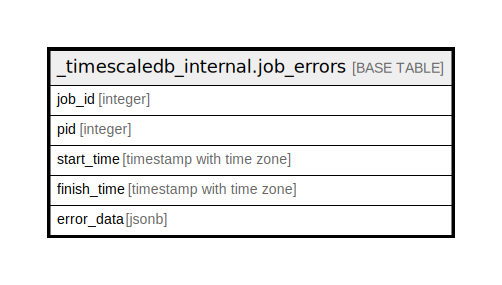

# _timescaledb_internal.job_errors

## Description

## Columns

| Name | Type | Default | Nullable | Children | Parents | Comment |
| ---- | ---- | ------- | -------- | -------- | ------- | ------- |
| job_id | integer |  | false |  |  |  |
| pid | integer |  | true |  |  |  |
| start_time | timestamp with time zone |  | true |  |  |  |
| finish_time | timestamp with time zone |  | true |  |  |  |
| error_data | jsonb |  | true |  |  |  |

## Relations

---

> Generated by [tbls](https://github.com/k1LoW/tbls)
