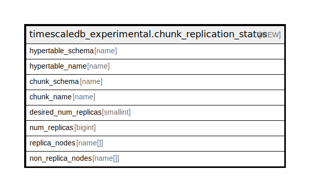

# timescaledb_experimental.chunk_replication_status

## Description

<details>
<summary><strong>Table Definition</strong></summary>

```sql
CREATE VIEW chunk_replication_status AS (
 SELECT h.schema_name AS hypertable_schema,
    h.table_name AS hypertable_name,
    c.schema_name AS chunk_schema,
    c.table_name AS chunk_name,
    h.replication_factor AS desired_num_replicas,
    count(cdn.chunk_id) AS num_replicas,
    array_agg(cdn.node_name) AS replica_nodes,
    ( SELECT array_agg(nodes.node_name) AS array_agg
           FROM ( SELECT hdn.node_name
                   FROM _timescaledb_catalog.hypertable_data_node hdn
                  WHERE (hdn.hypertable_id = h.id)
                EXCEPT
                 SELECT cdn_1.node_name
                   FROM _timescaledb_catalog.chunk_data_node cdn_1
                  WHERE (cdn_1.chunk_id = c.id)
          ORDER BY 1) nodes) AS non_replica_nodes
   FROM ((_timescaledb_catalog.chunk c
     JOIN _timescaledb_catalog.chunk_data_node cdn ON ((cdn.chunk_id = c.id)))
     JOIN _timescaledb_catalog.hypertable h ON ((h.id = c.hypertable_id)))
  GROUP BY h.id, c.id, h.schema_name, h.table_name, c.schema_name, c.table_name
  ORDER BY h.id, c.id, h.schema_name, h.table_name, c.schema_name, c.table_name
)
```

</details>

## Referenced Tables

- [_timescaledb_catalog.hypertable_data_node](_timescaledb_catalog.hypertable_data_node.md)
- [_timescaledb_catalog.chunk_data_node](_timescaledb_catalog.chunk_data_node.md)
- [_timescaledb_catalog.chunk](_timescaledb_catalog.chunk.md)
- [_timescaledb_catalog.hypertable](_timescaledb_catalog.hypertable.md)

## Columns

| Name | Type | Default | Nullable | Children | Parents | Comment |
| ---- | ---- | ------- | -------- | -------- | ------- | ------- |
| hypertable_schema | name |  | true |  |  |  |
| hypertable_name | name |  | true |  |  |  |
| chunk_schema | name |  | true |  |  |  |
| chunk_name | name |  | true |  |  |  |
| desired_num_replicas | smallint |  | true |  |  |  |
| num_replicas | bigint |  | true |  |  |  |
| replica_nodes | name[] |  | true |  |  |  |
| non_replica_nodes | name[] |  | true |  |  |  |

## Relations



---

> Generated by [tbls](https://github.com/k1LoW/tbls)
