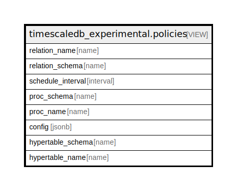

# timescaledb_experimental.policies

## Description

<details>
<summary><strong>Table Definition</strong></summary>

```sql
CREATE VIEW policies AS (
 SELECT ca.user_view_name AS relation_name,
    ca.user_view_schema AS relation_schema,
    j.schedule_interval,
    j.proc_schema,
    j.proc_name,
    j.config,
    ht.schema_name AS hypertable_schema,
    ht.table_name AS hypertable_name
   FROM ((_timescaledb_config.bgw_job j
     JOIN _timescaledb_catalog.continuous_agg ca ON ((ca.mat_hypertable_id = j.hypertable_id)))
     JOIN _timescaledb_catalog.hypertable ht ON ((ht.id = ca.mat_hypertable_id)))
)
```

</details>

## Referenced Tables

- [_timescaledb_config.bgw_job](_timescaledb_config.bgw_job.md)
- [_timescaledb_catalog.continuous_agg](_timescaledb_catalog.continuous_agg.md)
- [_timescaledb_catalog.hypertable](_timescaledb_catalog.hypertable.md)

## Columns

| Name | Type | Default | Nullable | Children | Parents | Comment |
| ---- | ---- | ------- | -------- | -------- | ------- | ------- |
| relation_name | name |  | true |  |  |  |
| relation_schema | name |  | true |  |  |  |
| schedule_interval | interval |  | true |  |  |  |
| proc_schema | name |  | true |  |  |  |
| proc_name | name |  | true |  |  |  |
| config | jsonb |  | true |  |  |  |
| hypertable_schema | name |  | true |  |  |  |
| hypertable_name | name |  | true |  |  |  |

## Relations



---

> Generated by [tbls](https://github.com/k1LoW/tbls)
