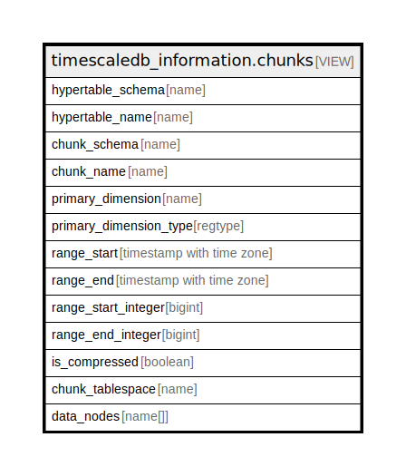

# timescaledb_information.chunks

## Description

<details>
<summary><strong>Table Definition</strong></summary>

```sql
CREATE VIEW chunks AS (
 SELECT finalq.hypertable_schema,
    finalq.hypertable_name,
    finalq.schema_name AS chunk_schema,
    finalq.chunk_name,
    finalq.primary_dimension,
    finalq.primary_dimension_type,
    finalq.range_start,
    finalq.range_end,
    finalq.integer_range_start AS range_start_integer,
    finalq.integer_range_end AS range_end_integer,
    finalq.is_compressed,
    finalq.chunk_table_space AS chunk_tablespace,
    finalq.node_list AS data_nodes
   FROM ( SELECT ht.schema_name AS hypertable_schema,
            ht.table_name AS hypertable_name,
            srcch.schema_name,
            srcch.table_name AS chunk_name,
            dim.column_name AS primary_dimension,
            dim.column_type AS primary_dimension_type,
            row_number() OVER (PARTITION BY chcons.chunk_id ORDER BY dim.id) AS chunk_dimension_num,
                CASE
                    WHEN (((dim.column_type)::oid = ('timestamp without time zone'::regtype)::oid) OR ((dim.column_type)::oid = ('timestamp with time zone'::regtype)::oid) OR ((dim.column_type)::oid = ('date'::regtype)::oid)) THEN _timescaledb_internal.to_timestamp(dimsl.range_start)
                    ELSE NULL::timestamp with time zone
                END AS range_start,
                CASE
                    WHEN (((dim.column_type)::oid = ('timestamp without time zone'::regtype)::oid) OR ((dim.column_type)::oid = ('timestamp with time zone'::regtype)::oid) OR ((dim.column_type)::oid = ('date'::regtype)::oid)) THEN _timescaledb_internal.to_timestamp(dimsl.range_end)
                    ELSE NULL::timestamp with time zone
                END AS range_end,
                CASE
                    WHEN (((dim.column_type)::oid = ('timestamp without time zone'::regtype)::oid) OR ((dim.column_type)::oid = ('timestamp with time zone'::regtype)::oid) OR ((dim.column_type)::oid = ('date'::regtype)::oid)) THEN NULL::bigint
                    ELSE dimsl.range_start
                END AS integer_range_start,
                CASE
                    WHEN (((dim.column_type)::oid = ('timestamp without time zone'::regtype)::oid) OR ((dim.column_type)::oid = ('timestamp with time zone'::regtype)::oid) OR ((dim.column_type)::oid = ('date'::regtype)::oid)) THEN NULL::bigint
                    ELSE dimsl.range_end
                END AS integer_range_end,
                CASE
                    WHEN ((srcch.status & 1) = 1) THEN true
                    ELSE false
                END AS is_compressed,
            pgtab.spcname AS chunk_table_space,
            chdn.node_list
           FROM (((((((_timescaledb_catalog.chunk srcch
             JOIN _timescaledb_catalog.hypertable ht ON ((ht.id = srcch.hypertable_id)))
             JOIN _timescaledb_catalog.chunk_constraint chcons ON ((srcch.id = chcons.chunk_id)))
             JOIN _timescaledb_catalog.dimension dim ON ((srcch.hypertable_id = dim.hypertable_id)))
             JOIN _timescaledb_catalog.dimension_slice dimsl ON (((dim.id = dimsl.dimension_id) AND (chcons.dimension_slice_id = dimsl.id))))
             JOIN ( SELECT pg_class.relname,
                    pg_class.reltablespace,
                    pg_namespace.nspname AS schema_name
                   FROM pg_class,
                    pg_namespace
                  WHERE (pg_class.relnamespace = pg_namespace.oid)) cl ON (((srcch.table_name = cl.relname) AND (srcch.schema_name = cl.schema_name))))
             LEFT JOIN pg_tablespace pgtab ON ((pgtab.oid = cl.reltablespace)))
             LEFT JOIN ( SELECT chunk_data_node.chunk_id,
                    array_agg(chunk_data_node.node_name ORDER BY chunk_data_node.node_name) AS node_list
                   FROM _timescaledb_catalog.chunk_data_node
                  GROUP BY chunk_data_node.chunk_id) chdn ON ((srcch.id = chdn.chunk_id)))
          WHERE ((srcch.dropped IS FALSE) AND (srcch.osm_chunk IS FALSE) AND (ht.compression_state <> 2))) finalq
  WHERE (finalq.chunk_dimension_num = 1)
)
```

</details>

## Referenced Tables

- [_timescaledb_catalog.chunk](_timescaledb_catalog.chunk.md)
- [_timescaledb_catalog.hypertable](_timescaledb_catalog.hypertable.md)
- [_timescaledb_catalog.chunk_constraint](_timescaledb_catalog.chunk_constraint.md)
- [_timescaledb_catalog.dimension](_timescaledb_catalog.dimension.md)
- [_timescaledb_catalog.dimension_slice](_timescaledb_catalog.dimension_slice.md)
- pg_class
- pg_tablespace
- [_timescaledb_catalog.chunk_data_node](_timescaledb_catalog.chunk_data_node.md)

## Columns

| Name | Type | Default | Nullable | Children | Parents | Comment |
| ---- | ---- | ------- | -------- | -------- | ------- | ------- |
| hypertable_schema | name |  | true |  |  |  |
| hypertable_name | name |  | true |  |  |  |
| chunk_schema | name |  | true |  |  |  |
| chunk_name | name |  | true |  |  |  |
| primary_dimension | name |  | true |  |  |  |
| primary_dimension_type | regtype |  | true |  |  |  |
| range_start | timestamp with time zone |  | true |  |  |  |
| range_end | timestamp with time zone |  | true |  |  |  |
| range_start_integer | bigint |  | true |  |  |  |
| range_end_integer | bigint |  | true |  |  |  |
| is_compressed | boolean |  | true |  |  |  |
| chunk_tablespace | name |  | true |  |  |  |
| data_nodes | name[] |  | true |  |  |  |

## Relations



---

> Generated by [tbls](https://github.com/k1LoW/tbls)
