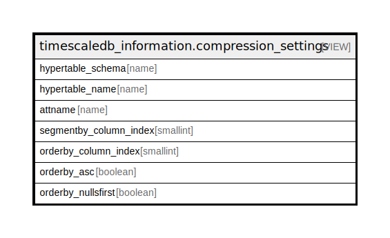

# timescaledb_information.compression_settings

## Description

<details>
<summary><strong>Table Definition</strong></summary>

```sql
CREATE VIEW compression_settings AS (
 SELECT ht.schema_name AS hypertable_schema,
    ht.table_name AS hypertable_name,
    segq.attname,
    segq.segmentby_column_index,
    segq.orderby_column_index,
    segq.orderby_asc,
    segq.orderby_nullsfirst
   FROM _timescaledb_catalog.hypertable_compression segq,
    _timescaledb_catalog.hypertable ht
  WHERE ((segq.hypertable_id = ht.id) AND ((segq.segmentby_column_index IS NOT NULL) OR (segq.orderby_column_index IS NOT NULL)))
  ORDER BY ht.table_name, segq.segmentby_column_index, segq.orderby_column_index
)
```

</details>

## Referenced Tables

- [_timescaledb_catalog.hypertable_compression](_timescaledb_catalog.hypertable_compression.md)

## Columns

| Name | Type | Default | Nullable | Children | Parents | Comment |
| ---- | ---- | ------- | -------- | -------- | ------- | ------- |
| hypertable_schema | name |  | true |  |  |  |
| hypertable_name | name |  | true |  |  |  |
| attname | name |  | true |  |  |  |
| segmentby_column_index | smallint |  | true |  |  |  |
| orderby_column_index | smallint |  | true |  |  |  |
| orderby_asc | boolean |  | true |  |  |  |
| orderby_nullsfirst | boolean |  | true |  |  |  |

## Relations



---

> Generated by [tbls](https://github.com/k1LoW/tbls)
