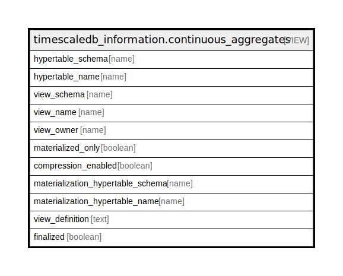

# timescaledb_information.continuous_aggregates

## Description

<details>
<summary><strong>Table Definition</strong></summary>

```sql
CREATE VIEW continuous_aggregates AS (
 SELECT ht.schema_name AS hypertable_schema,
    ht.table_name AS hypertable_name,
    cagg.user_view_schema AS view_schema,
    cagg.user_view_name AS view_name,
    viewinfo.viewowner AS view_owner,
    cagg.materialized_only,
        CASE
            WHEN (mat_ht.compressed_hypertable_id IS NOT NULL) THEN true
            ELSE false
        END AS compression_enabled,
    mat_ht.schema_name AS materialization_hypertable_schema,
    mat_ht.table_name AS materialization_hypertable_name,
    directview.viewdefinition AS view_definition,
    cagg.finalized
   FROM _timescaledb_catalog.continuous_agg cagg,
    _timescaledb_catalog.hypertable ht,
    LATERAL ( SELECT c.oid,
            pg_get_userbyid(c.relowner) AS viewowner
           FROM (pg_class c
             LEFT JOIN pg_namespace n ON ((n.oid = c.relnamespace)))
          WHERE ((c.relkind = 'v'::"char") AND (c.relname = cagg.user_view_name) AND (n.nspname = cagg.user_view_schema))) viewinfo,
    LATERAL ( SELECT pg_get_viewdef(c.oid) AS viewdefinition
           FROM (pg_class c
             LEFT JOIN pg_namespace n ON ((n.oid = c.relnamespace)))
          WHERE ((c.relkind = 'v'::"char") AND (c.relname = cagg.direct_view_name) AND (n.nspname = cagg.direct_view_schema))) directview,
    LATERAL ( SELECT hypertable.schema_name,
            hypertable.table_name,
            hypertable.compressed_hypertable_id
           FROM _timescaledb_catalog.hypertable
          WHERE (cagg.mat_hypertable_id = hypertable.id)) mat_ht
  WHERE (cagg.raw_hypertable_id = ht.id)
)
```

</details>

## Referenced Tables

- [_timescaledb_catalog.continuous_agg](_timescaledb_catalog.continuous_agg.md)
- pg_class
- pg_namespace
- [_timescaledb_catalog.hypertable](_timescaledb_catalog.hypertable.md)

## Columns

| Name | Type | Default | Nullable | Children | Parents | Comment |
| ---- | ---- | ------- | -------- | -------- | ------- | ------- |
| hypertable_schema | name |  | true |  |  |  |
| hypertable_name | name |  | true |  |  |  |
| view_schema | name |  | true |  |  |  |
| view_name | name |  | true |  |  |  |
| view_owner | name |  | true |  |  |  |
| materialized_only | boolean |  | true |  |  |  |
| compression_enabled | boolean |  | true |  |  |  |
| materialization_hypertable_schema | name |  | true |  |  |  |
| materialization_hypertable_name | name |  | true |  |  |  |
| view_definition | text |  | true |  |  |  |
| finalized | boolean |  | true |  |  |  |

## Relations



---

> Generated by [tbls](https://github.com/k1LoW/tbls)
