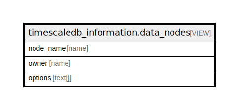

# timescaledb_information.data_nodes

## Description

<details>
<summary><strong>Table Definition</strong></summary>

```sql
CREATE VIEW data_nodes AS (
 SELECT s.node_name,
    s.owner,
    s.options
   FROM ( SELECT srv.srvname AS node_name,
            ((srv.srvowner)::regrole)::name AS owner,
            srv.srvoptions AS options
           FROM pg_foreign_server srv,
            pg_foreign_data_wrapper fdw
          WHERE ((srv.srvfdw = fdw.oid) AND (fdw.fdwname = 'timescaledb_fdw'::name))) s
)
```

</details>

## Referenced Tables

- pg_foreign_server

## Columns

| Name | Type | Default | Nullable | Children | Parents | Comment |
| ---- | ---- | ------- | -------- | -------- | ------- | ------- |
| node_name | name |  | true |  |  |  |
| owner | name |  | true |  |  |  |
| options | text[] |  | true |  |  |  |

## Relations



---

> Generated by [tbls](https://github.com/k1LoW/tbls)
