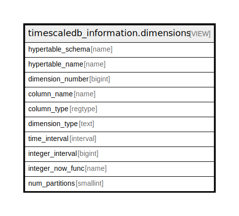

# timescaledb_information.dimensions

## Description

<details>
<summary><strong>Table Definition</strong></summary>

```sql
CREATE VIEW dimensions AS (
 SELECT ht.schema_name AS hypertable_schema,
    ht.table_name AS hypertable_name,
    rank() OVER (PARTITION BY dim.hypertable_id ORDER BY dim.id) AS dimension_number,
    dim.column_name,
    dim.column_type,
        CASE
            WHEN (dim.interval_length IS NULL) THEN 'Space'::text
            ELSE 'Time'::text
        END AS dimension_type,
        CASE
            WHEN (dim.interval_length IS NOT NULL) THEN
            CASE
                WHEN (((dim.column_type)::oid = ('timestamp without time zone'::regtype)::oid) OR ((dim.column_type)::oid = ('timestamp with time zone'::regtype)::oid) OR ((dim.column_type)::oid = ('date'::regtype)::oid)) THEN _timescaledb_internal.to_interval(dim.interval_length)
                ELSE NULL::interval
            END
            ELSE NULL::interval
        END AS time_interval,
        CASE
            WHEN (dim.interval_length IS NOT NULL) THEN
            CASE
                WHEN (((dim.column_type)::oid = ('timestamp without time zone'::regtype)::oid) OR ((dim.column_type)::oid = ('timestamp with time zone'::regtype)::oid) OR ((dim.column_type)::oid = ('date'::regtype)::oid)) THEN NULL::bigint
                ELSE dim.interval_length
            END
            ELSE NULL::bigint
        END AS integer_interval,
    dim.integer_now_func,
    dim.num_slices AS num_partitions
   FROM _timescaledb_catalog.hypertable ht,
    _timescaledb_catalog.dimension dim
  WHERE (dim.hypertable_id = ht.id)
)
```

</details>

## Referenced Tables

- [_timescaledb_catalog.hypertable](_timescaledb_catalog.hypertable.md)

## Columns

| Name | Type | Default | Nullable | Children | Parents | Comment |
| ---- | ---- | ------- | -------- | -------- | ------- | ------- |
| hypertable_schema | name |  | true |  |  |  |
| hypertable_name | name |  | true |  |  |  |
| dimension_number | bigint |  | true |  |  |  |
| column_name | name |  | true |  |  |  |
| column_type | regtype |  | true |  |  |  |
| dimension_type | text |  | true |  |  |  |
| time_interval | interval |  | true |  |  |  |
| integer_interval | bigint |  | true |  |  |  |
| integer_now_func | name |  | true |  |  |  |
| num_partitions | smallint |  | true |  |  |  |

## Relations



---

> Generated by [tbls](https://github.com/k1LoW/tbls)
