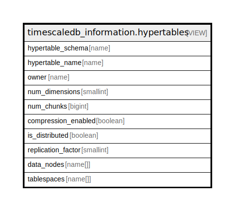

# timescaledb_information.hypertables

## Description

<details>
<summary><strong>Table Definition</strong></summary>

```sql
CREATE VIEW hypertables AS (
 SELECT ht.schema_name AS hypertable_schema,
    ht.table_name AS hypertable_name,
    t.tableowner AS owner,
    ht.num_dimensions,
    ( SELECT count(1) AS count
           FROM _timescaledb_catalog.chunk ch
          WHERE ((ch.hypertable_id = ht.id) AND (ch.dropped IS FALSE) AND (ch.osm_chunk IS FALSE))) AS num_chunks,
        CASE
            WHEN (ht.compression_state = 1) THEN true
            ELSE false
        END AS compression_enabled,
        CASE
            WHEN (ht.replication_factor > 0) THEN true
            ELSE false
        END AS is_distributed,
    ht.replication_factor,
    dn.node_list AS data_nodes,
    srchtbs.tablespace_list AS tablespaces
   FROM ((((_timescaledb_catalog.hypertable ht
     JOIN pg_tables t ON (((ht.table_name = t.tablename) AND (ht.schema_name = t.schemaname))))
     LEFT JOIN _timescaledb_catalog.continuous_agg ca ON ((ca.mat_hypertable_id = ht.id)))
     LEFT JOIN ( SELECT tablespace.hypertable_id,
            array_agg(tablespace.tablespace_name ORDER BY tablespace.id) AS tablespace_list
           FROM _timescaledb_catalog.tablespace
          GROUP BY tablespace.hypertable_id) srchtbs ON ((ht.id = srchtbs.hypertable_id)))
     LEFT JOIN ( SELECT hypertable_data_node.hypertable_id,
            array_agg(hypertable_data_node.node_name ORDER BY hypertable_data_node.node_name) AS node_list
           FROM _timescaledb_catalog.hypertable_data_node
          GROUP BY hypertable_data_node.hypertable_id) dn ON ((ht.id = dn.hypertable_id)))
  WHERE ((ht.compression_state <> 2) AND (ca.mat_hypertable_id IS NULL))
)
```

</details>

## Referenced Tables

- [_timescaledb_catalog.chunk](_timescaledb_catalog.chunk.md)
- [_timescaledb_catalog.hypertable](_timescaledb_catalog.hypertable.md)
- pg_tables
- [_timescaledb_catalog.continuous_agg](_timescaledb_catalog.continuous_agg.md)
- [_timescaledb_catalog.tablespace](_timescaledb_catalog.tablespace.md)
- [_timescaledb_catalog.hypertable_data_node](_timescaledb_catalog.hypertable_data_node.md)

## Columns

| Name | Type | Default | Nullable | Children | Parents | Comment |
| ---- | ---- | ------- | -------- | -------- | ------- | ------- |
| hypertable_schema | name |  | true |  |  |  |
| hypertable_name | name |  | true |  |  |  |
| owner | name |  | true |  |  |  |
| num_dimensions | smallint |  | true |  |  |  |
| num_chunks | bigint |  | true |  |  |  |
| compression_enabled | boolean |  | true |  |  |  |
| is_distributed | boolean |  | true |  |  |  |
| replication_factor | smallint |  | true |  |  |  |
| data_nodes | name[] |  | true |  |  |  |
| tablespaces | name[] |  | true |  |  |  |

## Relations



---

> Generated by [tbls](https://github.com/k1LoW/tbls)
