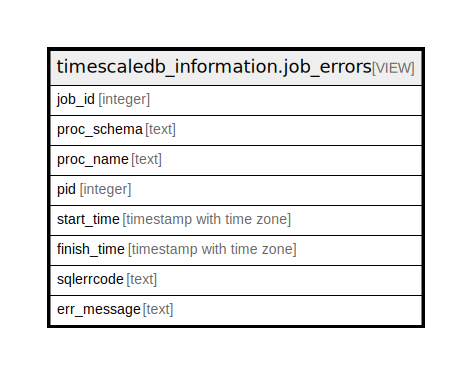

# timescaledb_information.job_errors

## Description

<details>
<summary><strong>Table Definition</strong></summary>

```sql
CREATE VIEW job_errors AS (
 SELECT job_errors.job_id,
    (job_errors.error_data ->> 'proc_schema'::text) AS proc_schema,
    (job_errors.error_data ->> 'proc_name'::text) AS proc_name,
    job_errors.pid,
    job_errors.start_time,
    job_errors.finish_time,
    (job_errors.error_data ->> 'sqlerrcode'::text) AS sqlerrcode,
        CASE
            WHEN ((job_errors.error_data ->> 'message'::text) IS NOT NULL) THEN
            CASE
                WHEN ((job_errors.error_data ->> 'detail'::text) IS NOT NULL) THEN
                CASE
                    WHEN ((job_errors.error_data ->> 'hint'::text) IS NOT NULL) THEN concat((job_errors.error_data ->> 'message'::text), '. ', (job_errors.error_data ->> 'detail'::text), '. ', (job_errors.error_data ->> 'hint'::text))
                    ELSE concat((job_errors.error_data ->> 'message'::text), ' ', (job_errors.error_data ->> 'detail'::text))
                END
                ELSE
                CASE
                    WHEN ((job_errors.error_data ->> 'hint'::text) IS NOT NULL) THEN concat((job_errors.error_data ->> 'message'::text), '. ', (job_errors.error_data ->> 'hint'::text))
                    ELSE (job_errors.error_data ->> 'message'::text)
                END
            END
            ELSE 'job crash detected, see server logs'::text
        END AS err_message
   FROM (_timescaledb_internal.job_errors
     LEFT JOIN _timescaledb_config.bgw_job ON ((bgw_job.id = job_errors.job_id)))
  WHERE ((pg_has_role(CURRENT_USER, ( SELECT pg_get_userbyid(pg_database.datdba) AS pg_get_userbyid
           FROM pg_database
          WHERE (pg_database.datname = current_database())), 'MEMBER'::text) IS TRUE) OR (pg_has_role(CURRENT_USER, (bgw_job.owner)::oid, 'MEMBER'::text) IS TRUE))
)
```

</details>

## Referenced Tables

- [_timescaledb_internal.job_errors](_timescaledb_internal.job_errors.md)
- [_timescaledb_config.bgw_job](_timescaledb_config.bgw_job.md)
- pg_database

## Columns

| Name | Type | Default | Nullable | Children | Parents | Comment |
| ---- | ---- | ------- | -------- | -------- | ------- | ------- |
| job_id | integer |  | true |  |  |  |
| proc_schema | text |  | true |  |  |  |
| proc_name | text |  | true |  |  |  |
| pid | integer |  | true |  |  |  |
| start_time | timestamp with time zone |  | true |  |  |  |
| finish_time | timestamp with time zone |  | true |  |  |  |
| sqlerrcode | text |  | true |  |  |  |
| err_message | text |  | true |  |  |  |

## Relations



---

> Generated by [tbls](https://github.com/k1LoW/tbls)
