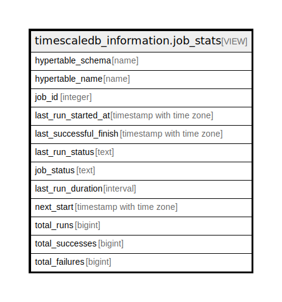

# timescaledb_information.job_stats

## Description

<details>
<summary><strong>Table Definition</strong></summary>

```sql
CREATE VIEW job_stats AS (
 SELECT ht.schema_name AS hypertable_schema,
    ht.table_name AS hypertable_name,
    j.id AS job_id,
    js.last_start AS last_run_started_at,
    js.last_successful_finish,
        CASE
            WHEN (js.last_finish < '4714-11-24 00:00:00+00 BC'::timestamp with time zone) THEN NULL::text
            WHEN (js.last_finish IS NOT NULL) THEN
            CASE
                WHEN (js.last_run_success = true) THEN 'Success'::text
                WHEN (js.last_run_success = false) THEN 'Failed'::text
                ELSE NULL::text
            END
            ELSE NULL::text
        END AS last_run_status,
        CASE
            WHEN (pgs.state = 'active'::text) THEN 'Running'::text
            WHEN (j.scheduled = false) THEN 'Paused'::text
            ELSE 'Scheduled'::text
        END AS job_status,
        CASE
            WHEN (js.last_finish > js.last_start) THEN (js.last_finish - js.last_start)
            ELSE NULL::interval
        END AS last_run_duration,
        CASE
            WHEN j.scheduled THEN js.next_start
            ELSE NULL::timestamp with time zone
        END AS next_start,
    js.total_runs,
    js.total_successes,
    js.total_failures
   FROM (((_timescaledb_config.bgw_job j
     JOIN _timescaledb_internal.bgw_job_stat js ON ((j.id = js.job_id)))
     LEFT JOIN _timescaledb_catalog.hypertable ht ON ((j.hypertable_id = ht.id)))
     LEFT JOIN pg_stat_activity pgs ON (((pgs.datname = current_database()) AND (pgs.application_name = j.application_name))))
  ORDER BY ht.schema_name, ht.table_name
)
```

</details>

## Referenced Tables

- [_timescaledb_config.bgw_job](_timescaledb_config.bgw_job.md)
- [_timescaledb_internal.bgw_job_stat](_timescaledb_internal.bgw_job_stat.md)
- [_timescaledb_catalog.hypertable](_timescaledb_catalog.hypertable.md)
- pg_stat_activity

## Columns

| Name | Type | Default | Nullable | Children | Parents | Comment |
| ---- | ---- | ------- | -------- | -------- | ------- | ------- |
| hypertable_schema | name |  | true |  |  |  |
| hypertable_name | name |  | true |  |  |  |
| job_id | integer |  | true |  |  |  |
| last_run_started_at | timestamp with time zone |  | true |  |  |  |
| last_successful_finish | timestamp with time zone |  | true |  |  |  |
| last_run_status | text |  | true |  |  |  |
| job_status | text |  | true |  |  |  |
| last_run_duration | interval |  | true |  |  |  |
| next_start | timestamp with time zone |  | true |  |  |  |
| total_runs | bigint |  | true |  |  |  |
| total_successes | bigint |  | true |  |  |  |
| total_failures | bigint |  | true |  |  |  |

## Relations



---

> Generated by [tbls](https://github.com/k1LoW/tbls)
