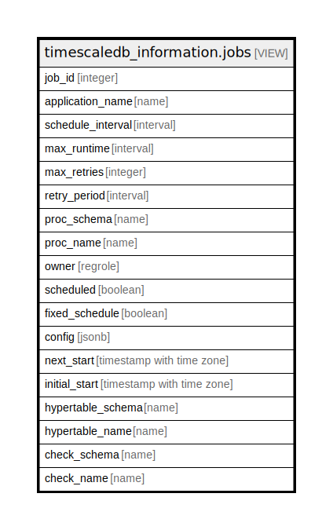

# timescaledb_information.jobs

## Description

<details>
<summary><strong>Table Definition</strong></summary>

```sql
CREATE VIEW jobs AS (
 SELECT j.id AS job_id,
    j.application_name,
    j.schedule_interval,
    j.max_runtime,
    j.max_retries,
    j.retry_period,
    j.proc_schema,
    j.proc_name,
    j.owner,
    j.scheduled,
    j.fixed_schedule,
    j.config,
    js.next_start,
    j.initial_start,
    ht.schema_name AS hypertable_schema,
    ht.table_name AS hypertable_name,
    j.check_schema,
    j.check_name
   FROM ((_timescaledb_config.bgw_job j
     LEFT JOIN _timescaledb_catalog.hypertable ht ON ((ht.id = j.hypertable_id)))
     LEFT JOIN _timescaledb_internal.bgw_job_stat js ON ((js.job_id = j.id)))
)
```

</details>

## Referenced Tables

- [_timescaledb_config.bgw_job](_timescaledb_config.bgw_job.md)
- [_timescaledb_catalog.hypertable](_timescaledb_catalog.hypertable.md)
- [_timescaledb_internal.bgw_job_stat](_timescaledb_internal.bgw_job_stat.md)

## Columns

| Name | Type | Default | Nullable | Children | Parents | Comment |
| ---- | ---- | ------- | -------- | -------- | ------- | ------- |
| job_id | integer |  | true |  |  |  |
| application_name | name |  | true |  |  |  |
| schedule_interval | interval |  | true |  |  |  |
| max_runtime | interval |  | true |  |  |  |
| max_retries | integer |  | true |  |  |  |
| retry_period | interval |  | true |  |  |  |
| proc_schema | name |  | true |  |  |  |
| proc_name | name |  | true |  |  |  |
| owner | regrole |  | true |  |  |  |
| scheduled | boolean |  | true |  |  |  |
| fixed_schedule | boolean |  | true |  |  |  |
| config | jsonb |  | true |  |  |  |
| next_start | timestamp with time zone |  | true |  |  |  |
| initial_start | timestamp with time zone |  | true |  |  |  |
| hypertable_schema | name |  | true |  |  |  |
| hypertable_name | name |  | true |  |  |  |
| check_schema | name |  | true |  |  |  |
| check_name | name |  | true |  |  |  |

## Relations



---

> Generated by [tbls](https://github.com/k1LoW/tbls)
